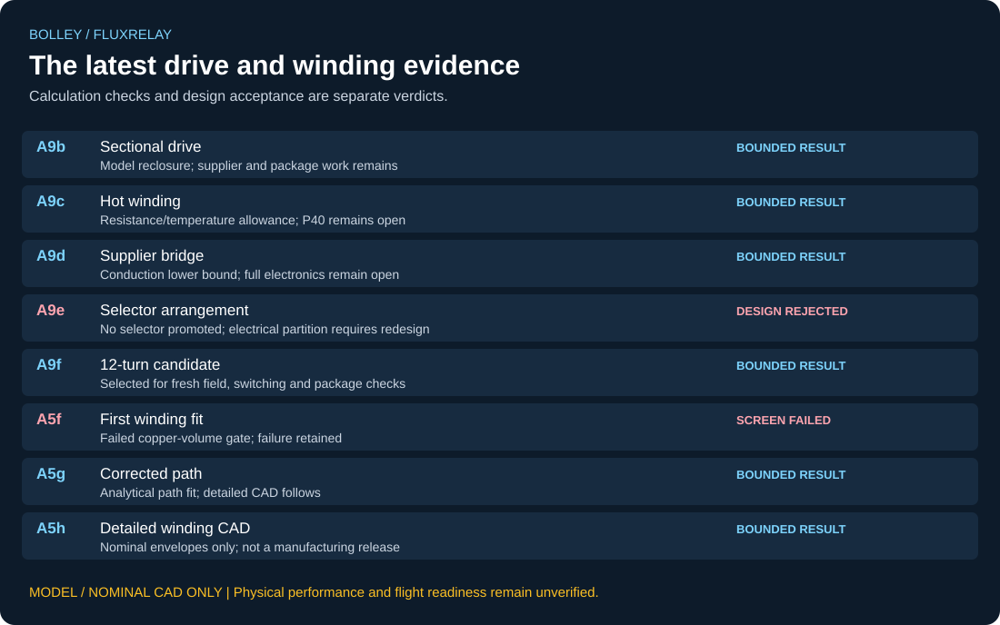

# BOLLEY

**What changes if the satellite carries a passive reaction interface?**

I am developing a cooperative CubeSat deployer alongside [VOLLEY](https://github.com/aaaaaaaaaaaavm/VOLLEY).
VOLLEY aims to keep the payload mechanically and electrically unmodified. BOLLEY lets it carry a
passive magnetic/copper interface while the launcher retains the windings, electronics and stored
energy. That trade removes the launch sled, its brake and its return stroke.

**Computational design study. Nothing has been built, measured, qualified or flown.**

[Project website](https://aaaaaaaaaaaavm.github.io/VOLLEY/bolley.html) · [Latest evidence](docs/CURRENT_REVIEW.md) · [Requirements](REQUIREMENTS.md) ·
[Completion standard](docs/COMPLETION_STANDARD.md) · [Open problems](OPEN_PROBLEMS.md) ·
[Shared prototype programme](https://github.com/aaaaaaaaaaaavm/VOLLEY/blob/main/docs/PROTOTYPE_READINESS.md)


This is the controlled Gen3 nominal assembly. The later detailed 12-turn winding is a candidate
with its own CAD gate; it does not silently replace this assembly or inherit a complete electrical design.

## The current machine

| Item | Controlled study |
|---|---|
| Reference payload and duty | 4 kg 3U, 11.8 m/s over 0.90 m, at most 8 g nominal |
| Qualification sizing case | 6 kg 3U; a design case, not a qualification result |
| Passive interface | 318.6 mm five-lane Fluxrelay cage; 0.37136 kg modelled increment |
| Stationary primary | Four face channels; 27 cells per channel, 45.3 mm pitch, 1.2231 m length |
| Primary material mass | 15.908 kg; structure, cooling, wiring and power electronics are additional |
| Later electrical candidate | A9f selects 12 turns and approximately 126.667 A rated phase current |
| Latest winding gate | A5h: 10/10 nominal-CAD bands pass; manufacturing and electrical closure remain open |
| Selected drive reclosure | [A9g](docs/SELECTED_WINDING_RECLOSURE.md): 12-turn handoff envelope reproduces turn scaling; 6/16 assumed loss corners stay below the 900 J reference cap |

I now have 10.280918 J of reference-shot margin at A9f's 25 C conduction point.
A9g shows exactly how assumed hot conduction and additional losses consume it. That is a
remaining loss budget, not a supplier-backed switching or thermal design.

The initial 12 m/s target was inconsistent with 8 g over 0.90 m. A10 found the contradiction
and ADR-040 changed the target to 11.8 m/s. The earlier requirement and failed result remain recorded.

## The decisions worth inspecting



The review surface is generated from committed JSON results. **A screen can pass while rejecting
its design.** A9e does exactly that: its calculation supports rejecting the selector arrangement.
[CURRENT_REVIEW.md](docs/CURRENT_REVIEW.md) exposes the source disposition and remaining limits for each run.

- **Geometry changed the conclusion.** Gen1's apparently viable thin-sheet machine failed its
  exact winding-window/CAD check. The rejected branch remains in the record.
- **Axial overlap changed the package.** A8a rejected the original full-engagement assumption.
  A8b found 77 passing points among 2,856 declared candidates and selected one by its frozen rule.
- **The selected point earned fresh checks.** A6h supplied nonlinear-field results; A7c reclosed
  the cage/circuit; A5e closed nominal full-assembly fit.
- **The electronics changed the winding.** A9b–A9f carried the drive through residual correction,
  hot-winding margin, supplier conduction and selector architecture. A9f selected twelve turns
  for downstream investigation.
- **The first twelve-turn fit failed.** A5f's copper-volume failure is retained. A5g corrected the
  path, then A5h checked twelve individual conductor envelopes and the full face.

The [historical run status](validation/STATUS.md) and [latest review](docs/CURRENT_REVIEW.md)
together describe that sequence. A count of passed checks alone does not.

## What must happen before a complete prototype review

1. **Finish the electrical candidate.** Audit RMS/peak and internal-path current definitions;
   check the actual winding field and lead geometry; include hot conduction, switching,
   parasitics, protection and cooling across the full campaign.
2. **Close the moving clearances and load paths.** The nominal lane gap needs manufacturing,
   thermal and dynamic tolerance analysis. Cage attachment, retention and the launch interface
   need structural evidence.
3. **Predict the release state.** Propagate force imbalance, sensing/CG error, end effects and
   failed-channel behaviour into six-degree-of-freedom motion and tip-off.
4. **Count the complete system.** Primary material and semiconductor module mass are partial
   budgets. Installed mass must include every required subsystem and the spacecraft interface.
5. **Make the experiment buildable.** Drawings, BOM, assembly/inspection instructions,
   instrumentation and frozen acceptance criteria must describe the same configuration.

The [completion standard](docs/COMPLETION_STANDARD.md) governs these tasks. A5h closes nominal
CAD only. It does not establish manufacturability, transient force, thermal margin, electromagnetic
compatibility or flight readiness.

## Keep the branches separate

| Direction | Question | Status |
|---|---|---|
| **Fluxrelay** | Does a passive interface earn its spacecraft mass while the launcher retains pulsed electromagnetic drive? | Active machine to finish |
| Fluxframe | Can the interface replace named bus structure, heat-spreading or grounding parts? | Exploratory; no displaced-part mass credit without a demonstrated replacement |
| Fluxpiston | Can gas supply bulk acceleration through a passive aft interface? | Separate pressure, seal, contact and plume problem |

[GENERATIONS.md](docs/GENERATIONS.md) defines the branches. None can inherit another branch's
passed results simply because it shares a name or a piece of geometry.

## Review and reproduce

| Review question | Evidence route |
|---|---|
| What is required? | [REQUIREMENTS](REQUIREMENTS.md), [KILL_CRITERIA](docs/KILL_CRITERIA.md) |
| What does the latest candidate establish? | [CURRENT_REVIEW](docs/CURRENT_REVIEW.md), [A5h](validation/A5h_gen3_12turn_detailed_cad.md) |
| What controls the nominal assembly? | [GEN3_CAD_FIT](docs/GEN3_CAD_FIT.md), [manual details](cad/GEN3_MANUAL_DETAILS.md) |
| What failed or remains unresolved? | [OPEN_PROBLEMS](OPEN_PROBLEMS.md), [DECISION_LOG](DECISION_LOG.md) |
| Where do the figures and claims come from? | [FIGURE_INDEX](docs/FIGURE_INDEX.md), [PROVENANCE](docs/PROVENANCE.md) |

```bash
python -m pip install -r requirements-field.txt -r requirements-cad.txt
python tools/check_repo.py
```

The checker runs the listed analytical reproductions, artifact checks and regressions. An
artifact hash check is not a fresh field solve or a CAD rebuild. The original field and CAD
scripts expose their separate reconstruction commands; see [CONTRIBUTING.md](docs/CONTRIBUTING.md).
The current-review surfaces can be checked separately with `python tools/make_review_snapshot.py --check`.

The earlier long-form introduction is retained in
[the preceding revision](https://github.com/aaaaaaaaaaaavm/BOLLEY/blob/2028393b25dae8094be0e8ff3327985cb25e281d/README.md).
It is a historical account, not the current work queue.

## Author and licence

**Adityavardhan Mishra** · Mechanical Engineering, Symbiosis Institute of Technology, Pune.
[adityavardhanmishr@gmail.com](mailto:adityavardhanmishr@gmail.com)

[CC BY 4.0](LICENSE). Attribution and scope: [NOTICE](NOTICE), [LICENSING](LICENSING.md), [CITATION.cff](CITATION.cff).
I welcome reproducible discrepancies and independent design review.
