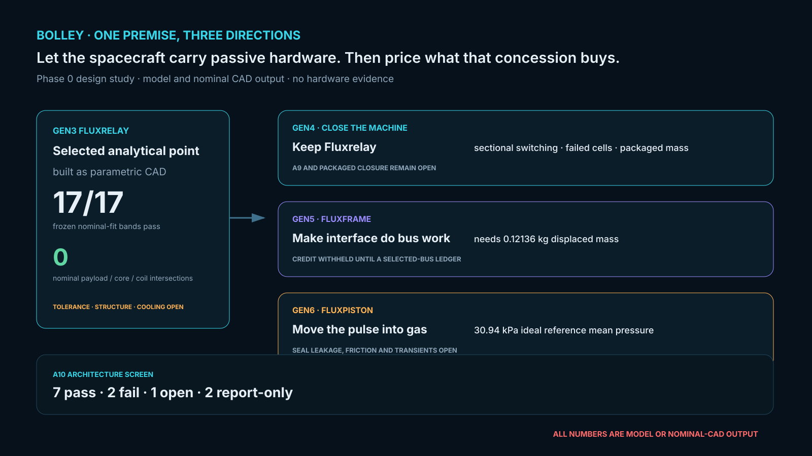
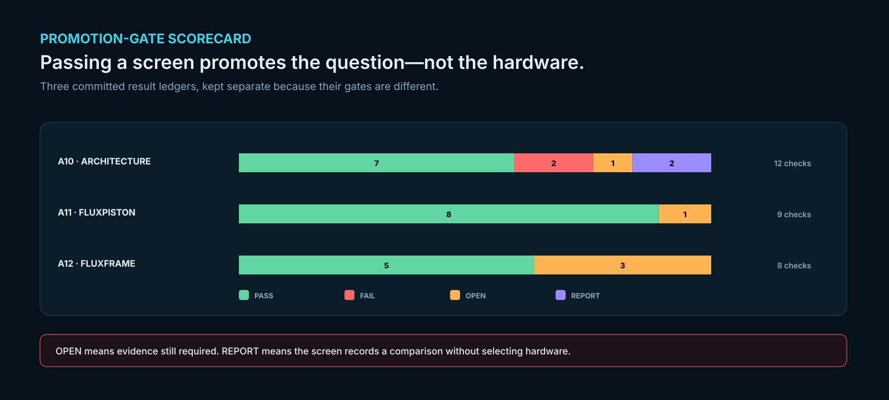
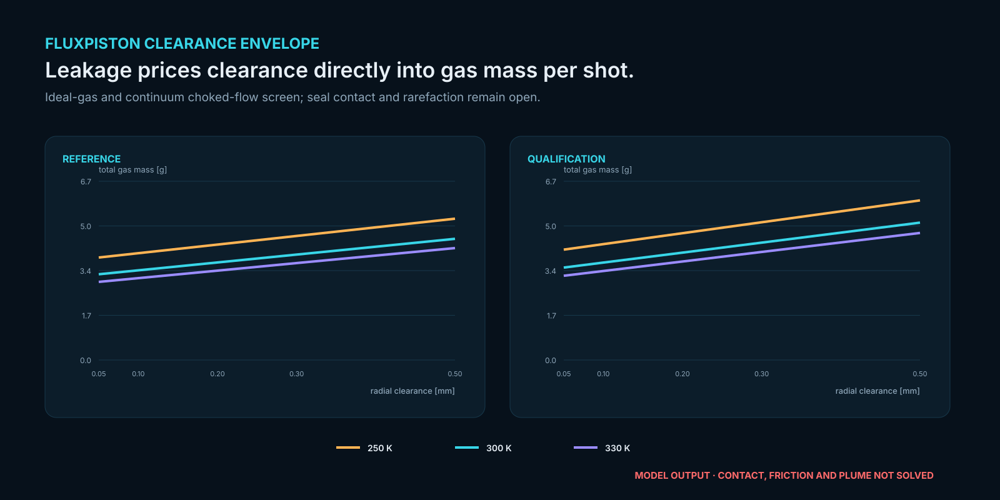

# Bolley

[](LICENSE)
[](https://github.com/aaaaaaaaaaaavm/BOLLEY/actions/workflows/gates.yml)

**The other answer to the same question: let the satellite help.**

A CubeSat deployer normally carries every moving part itself. Bolley asks what happens if the
spacecraft accepts a few hundred grams of passive hardware — no power, no electronics, nothing to
command — and the launcher sheds kilograms of machinery in exchange.

**It is the sibling study to [VOLLEY](https://github.com/aaaaaaaaaaaavm/VOLLEY)**, which refuses
that trade and keeps the satellite untouched. The two are developed to the same standard, and
neither is a fallback for the other: they test opposite premises, and this repository records
what its premise actually bought.

> **Status:** This is my Phase 0 design study. I have not built, measured, qualified or flown
> Bolley. I label every number here as an assumption, model output, external datum or measurement
> so I cannot quietly turn a calculation into evidence.




<p align="center">
  
  
</p>

<p align="center"><sub>The scorecard distinguishes a passed numerical screen from an open
hardware gate. The clearance envelope is regenerated from all 30 A11 grid points; its flow model
does not include seal contact, friction, rarefaction or plume behaviour.</sub></p>

<p align="center"><sub>I regenerate this roadmap from my committed A5e, A10 and A12 results with
<code>tools/generate_readme_figure.py</code>. It separates the exact Gen3 nominal CAD from three
forward directions and keeps every open gate attached. It is model and nominal-CAD output, not
hardware evidence.</sub></p>

I began with VOLLEY by asking whether I could give an unmodified CubeSat a programmable deployment
velocity without making it carry propulsion. I answered that question with a reusable magnetic
sled. The model worked, but the sled became 9.445 kg: most of my energy accelerated launcher
hardware, and most of my mechanism existed only to stop and return it.

With Bolley, I change one premise. I let a compatible CubeSat carry four **passive reaction
interfaces** while I keep every winding, switch, sensor and joule of stored energy on the launcher.
The spacecraft itself becomes the passive translator of a segmented linear electromagnetic
machine.

That small concession lets me remove the launch sled, the post-release brake and the return stroke.

I record the uncomfortable branches as carefully as the promising one. I rejected a buried return,
a three-fin comb and a shared-pole quad-comb for different physical reasons. Gen1 Fluxfoil passed
my thin-sheet circuit, then exact CAD exposed a 66.7:1 copper-window deficit. I answered that failure
with **Fluxbridge**: a passive perforated magnetic matrix with a shorted copper ladder.

I then took the design through seven field iterations. Gen2.5 Fluxweb gave me the first 13/13
transverse-field pass. Its four lanes still overheated, so I added a fifth in Gen2.6 Quintweb. A6g
again passed 13/13; in A7b I found that the fifth lane closed cage temperature, current density,
slip and secondary efficiency. Only the 125% winding-resistance reference shot remained high, at
959.9 J against 900 J.

In A8a I found the more important axial contradiction: a 336 mm cage cannot remain fully engaged
while travelling 900 mm through a 900 mm stator. My as-drawn package produces 10.70 m/s, and a
simple full-overlap extension reaches 22.20 kg.

In A8b I closed that analytical contradiction by co-designing cage length, cell pitch, current and
copper instead of correcting them one at a time. Of my 2,856 declared candidates, 77 pass every
hard band. I selected **Gen2.7 Fluxrelay** by minimax margin: 27 cells at 45.3 mm pitch, 380 A and
10.4 mm2 per turn; a 318.6 mm passive cage traverses a 1.2231 m sectional primary with 2.25 mm
engagement guards. I calculate a 895.47 J hot reference shot and 15.91 kg installed primary mass.
Those margins are model outputs, not hardware evidence. In A6h I replaced the scaled field with
three fresh nonlinear meshes: all 13 frozen bands pass, with 1.5284 T worst stationary peak,
1.3434 T worst moving peak and 4.81156 uH fine three-cell phase-window inductance. In A7c all four
selected-point robustness corners pass all 29 bands. My controlling reference shot is 893.412 J,
only 6.588 J below my unchanged 900 J cap.

In A5e I then built that exact point as a new Gen3 parametric assembly rather than stretching my
historical Gen2 CAD. All 17 frozen nominal-fit bands pass. I generated eight STEP masters, eight
STL previews and ten inspected views; exact nominal payload/core/coil intersections are zero, the
winding volume matches A8b to numerical round-off, and the cage retains its 2.25 mm engagement
guard after 900 mm travel. This closes nominal geometry only. It does not create tolerances,
structure, cooling, electronics or hardware evidence.

> ## The sibling design moved on 2026-08-14, and it computed something that applies here
>
> VOLLEY's A35 attributed every kilogram to the requirement causing it. **The mover is 11 % of dry
> mass** — so deleting the sled, which is what I do here, saves a ninth. **The
> requirement that costs is the pulse, at 28.1 %**, and I keep it: 380 A, 27 cells, a
> 1.2231 m sectional primary, and **P11** still open on supplier-backed pulse ratings.
>
> **Bolley is the corroboration and it is the stronger evidence.** VOLLEY computed the result as an
> attribution; here I **carried the deletion through a design**, across seven field iterations and
> 2,856 declared candidates, and the mass came back as a **15.91 kg primary**. *Modelled, not
> built — nothing in either project exists as hardware.* My own **P39** says that figure excludes structure, cooling,
> wiring and power electronics.
>
> VOLLEY's answer — ADR-032 — deletes the pulse instead: cold gas along a rail a spent stage
> provides, at a charging draw two orders of magnitude below a pulse chain's, from a single sized
> gas store for twelve shots. *(VOLLEY's store has been resized since; that repository holds the
> current figure and this one deliberately does not restate it.)*
>
> **I retract nothing.** A8b's point stands, its bands stand, A6h and A7c remain my next
> kill gates. What changes is the comparison, and the open question I should now
> carry: **is a cooperative interface worth 0.371 kg of spacecraft mass while the pulse remains?**

## The architecture I am carrying forward

- Four independently controlled face channels apply axial force around the spacecraft.
- Software distributes force so its centroid follows the declared payload centre of gravity.
- Each face channel contains a 27-cell, 1.2231 m sectional stationary primary.
- A 318.6 mm five-lane passive cage energises at most three cells per phase in each channel.
- The corrected Phase 0 reference duty is a 4 kg 3U payload, at most 8 g and 11.8 m/s.
- A 6 kg 3U is the qualification sizing case, not silently treated as a 4 kg satellite.
- No permanent magnets, powered spacecraft hardware, pyrotechnics or pressure vessels are added.
- An independent gate carries ascent loads and prevents an uncommanded deployment.
- When the field ends, the CubeSat coasts out. No moving launcher member follows it.

## What I mean by Gen4, Gen5 and Gen6

I now reserve generation numbers for a changed controlling claim:

- **Gen4** closes the selected Fluxrelay machine: sectional switching, failed-cell behaviour,
  tolerance, structure, thermal control, electronics and packaged mass.
- **Gen5 Fluxframe** asks the 0.37136 kg passive interface to replace bus structure, heat spreading,
  grounding and guidance hardware. It must displace at least 121.36 g on a selected bus before it
  meets my 0.25 kg net preference.
- **Gen6 Fluxpiston** deletes the bulk pulse. The spacecraft's passive aft interface becomes a
  low-pressure piston over the full face; a short electromagnetic section is retained only for
  trim, centring and exit shaping.

My first frozen A10 screen found that Fluxpiston needs 30.942 kPa ideal mean pressure for 4 kg at
11.8 m/s and 33.333 kPa for 6 kg at 10 m/s over 0.90 m. A +/-0.25 m/s trim changes payload kinetic
energy by at most 15.188 J. Those are architecture screens, not a valve, seal or gas-system design.
The approximately 400 mm moving seal perimeter is now the controlling Gen6 defect.

In A12 I compared Gen5's 121.36 g target with three sourced public 3U chassis masses. It is
30.80–42.58% of that envelope. A hypothetical full replacement would range from a 22.64 g net
saving to an 86.36 g net addition, but I award zero credit: no Fluxframe yet carries a selected
bus's loads or replaces one named part. Gen5 advances only to bus selection, a removed-parts ledger
and coupled structural/thermal/electrical/magnetic work.

In A11 I tested whether intentional clearance leakage kills that direction before seal design. All
eight executable frozen bands pass across 0.05–0.50 mm clearance and 250–330 K. The worst declared
point uses 6.009 g nitrogen per shot; twelve shots use 72.11 g, an ideal-gas equivalent 3.531 L at
20 bar and 330 K before tank hardware and margin. A 4.232 mm equivalent feed diameter carries the
peak calculated flow. I retain those as first-order flow numbers only: pressure dynamics, contact,
rarefied flow, lateral bypass force, contamination and plume impulse remain open and block CAD.

I also found and corrected a contradiction: 8 g over 0.90 m reaches 11.8855 m/s, so I changed the
reference requirement from 12.0 to **11.8 m/s** rather than asking every later model to violate one
of three numbers.

See my [generation definitions](docs/GENERATIONS.md), [A10 result](docs/GEN456_ARCHITECTURE_SCREEN.md),
[A11 flow screen](docs/FLUXPISTON_FLOW.md) and [unknown-unknown search](docs/UNKNOWN_UNKNOWNS.md).
My [A12 Fluxframe mass envelope](docs/FLUXFRAME_MASS.md) defines the Gen5 entry point.

I continue to reject the original six-tile / 900 mm arrangement. In Fluxrelay I count every
installed cell against the launcher mass band, but I charge only the conservative active window
with pulse loss. That is the correction: inactive copper does not disappear from my mass ledger.

## The zero-modification control I use

In VOLLEY I tested the strongest zero-modification control: drive directly on the existing CDS
aluminium corner rails. In [A30](https://github.com/aaaaaaaaaaaavm/VOLLEY/commit/acce22e04f3ba81e8d44d5318f78949a0518fb7a)
I rejected it. My solved transverse edge factor is 0.0253 rather than 0.55, leaving only 41.9 N even
at a generous 0.60 T. Pole pitch cannot simultaneously rescue the narrow conductor and large
rail-to-stator gap.

My surviving VOLLEY direction at the time was a roughly 90 mm conductive plate: 0.248 kg in the
analytical example, with much better edge utilization. **I use that as Bolley's honest control, and
it is deliberately frozen as a control** — VOLLEY's own architecture has since moved to a
gas-driven stage-integrated design that carries no plate at all, which changes VOLLEY and changes
nothing about whether Fluxrelay earns its interface. Fluxrelay must
earn its 0.371 kg interface through four-channel force-centroid authority, a controlled magnetic
path, tolerance to rail alloy/anodization, lower launcher complexity or lower cost. I do not accept
“no sled” alone as enough.

## What is not claimed

I have not demonstrated force density, commutation voltage, thermal margin, electromagnetic
compatibility, tip-off, rail life, cost or customer acceptance. I use the current calculations as
screens to decide which coupon to build. I do not treat them as validation of the machine.

I think the exact combination may be unusual. I do not treat that as proof of novelty or
patentability.

## My current controlled baseline

| Layer | Current evidence | Disposition |
|---|---|---|
| Selected payload interface | 318.6 mm five-lane Fluxrelay cage; 0.37136 kg modelled increment | 28.64 g below absolute limit; both preferences missed |
| Selected primary | 27 cells/channel, 45.3 mm pitch, 380 A, 10.4 mm2/turn | 1.2231 m and 15.908 kg installed |
| A8b coupled closure | 77/2,856 candidates pass; selected worst demand 0.99496 | I promoted one analytical point through A6h and A7c |
| Transverse field | A6h passed 13/13 on 212,850 / 751,282 / 240,130 elements at 380 A | I replace the surrogate with 1.5284 T stationary, 1.3434 T moving and 4.81156 uH phase-window results |
| Cage + circuit | A7c passes 4/4 corners and 29/29 bands; hot reference 893.412 J | I preserve the 6.588 J model margin as narrow and keep A9 open |
| Axial engagement | 318.6 mm cage inside 1.2231 m stator over 900 mm travel | 2.25 mm modelled guard at both endpoints |
| CAD | A5e passes 17/17; eight STEP + eight STL Gen3 masters and ten inspected renders | Nominal fit is closed; tolerances, structure and packaged mass remain open |
| Hardware evidence | None | Central claim remains open |

## Start here

1. [`REQUIREMENTS.md`](REQUIREMENTS.md) — what the machine must do.
2. [`HISTORY.md`](HISTORY.md) — real project lineage without backdating Bolley.
3. [`docs/CONCEPT.md`](docs/CONCEPT.md) — architecture and shot sequence.
4. [`docs/KILL_CRITERIA.md`](docs/KILL_CRITERIA.md) — numbers that can end the concept.
5. [`docs/GEN26_FIELD.md`](docs/GEN26_FIELD.md) — the passing five-lane transverse field.
6. [`docs/GEN26_CAGE_CIRCUIT.md`](docs/GEN26_CAGE_CIRCUIT.md) — the isolated hot-energy miss.
7. [`docs/AXIAL_ENGAGEMENT.md`](docs/AXIAL_ENGAGEMENT.md) — why the exact axial package is rejected.
8. [`docs/GEN27_CODESIGN.md`](docs/GEN27_CODESIGN.md) — the selected Fluxrelay package and margins.
9. [`docs/GEN27_FIELD.md`](docs/GEN27_FIELD.md) — my fresh selected-point nonlinear-field result.
10. [`docs/GEN27_CAGE_CIRCUIT.md`](docs/GEN27_CAGE_CIRCUIT.md) — my selected-point sectional circuit reclosure.
11. [`docs/GEN3_CAD_FIT.md`](docs/GEN3_CAD_FIT.md) — my exact nominal fit, renders and STEP/STL package.
12. [`cad/GEN3_MANUAL_DETAILS.md`](cad/GEN3_MANUAL_DETAILS.md) — every detail I still refuse to hide.
13. [`docs/GEN2_CAD_FIT.md`](docs/GEN2_CAD_FIT.md) — my historical CAD evidence and failed/superseded path.
14. [`validation/STATUS.md`](validation/STATUS.md) — every declared run and its disposition.
15. [`OPEN_PROBLEMS.md`](OPEN_PROBLEMS.md) — my live defect register.
16. [`DECISION_LOG.md`](DECISION_LOG.md) — my compact decision chain with full ADRs.
17. [`docs/FIGURE_INDEX.md`](docs/FIGURE_INDEX.md) — every visual, its source and evidence class.
18. [`docs/PROVENANCE.md`](docs/PROVENANCE.md) — what is simulated, cross-checked and still absent.
19. [`docs/HUMAN_ACTIONS.md`](docs/HUMAN_ACTIONS.md) — hardware, supplier and provider actions code cannot close.

## Reproduce

The algebraic stages require only Python. My Gen3 CAD uses the pinned packages in
`requirements-cad.txt`; field reproduction uses `requirements-field.txt`.

```bash
python tools/check_repo.py
python analysis/gen27_codesign.py --check
python analysis/gen27_field.py --artifact-check
python analysis/gen27_cage_circuit.py --check
python cad/build_gen3.py --check
python cad/render_gen3.py --check
python tools/package_gen3_cad.py --check
python analysis/gen3_cad_fit.py --check
python analysis/gen27_field.py --check  # full three-mesh A6h re-solve
```

`tools/check_repo.py` verifies deterministic outputs, package manifests, local links and the
declared stage sequence. I keep the complete A6h re-solve explicit because it is materially more
expensive than an artifact-integrity check.

## Rules I use for this repository

1. I write requirements before calculations.
2. I freeze validation bands before results and never widen them after a run.
3. I call model-to-model agreement a cross-check, not experimental validation.
4. I change generated results through their scripts, never by hand.
5. I let a failed result change the design or kill it; I do not change the threshold.
6. I never mix assumptions, external data, model outputs and measurements without labels.
7. I keep this repository as my engineering record, not a paper-production project.

## Licence and citation

I release the complete repository under [CC BY 4.0](LICENSE). The scope and patent boundary are in
[`LICENSING.md`](LICENSING.md), requested attribution is in [`NOTICE`](NOTICE), and machine-readable
citation metadata is in [`CITATION.cff`](CITATION.cff). Bolley had no earlier explicit licence, so
I do not claim that it was ever MIT-licensed.
