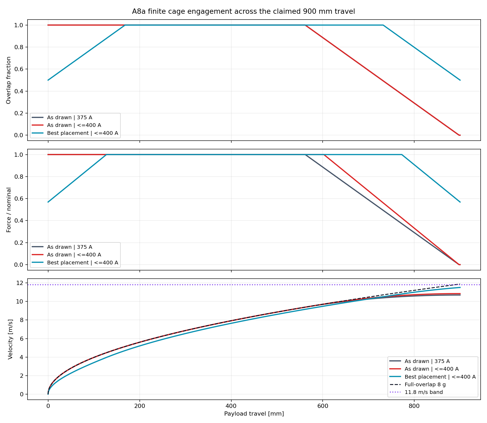
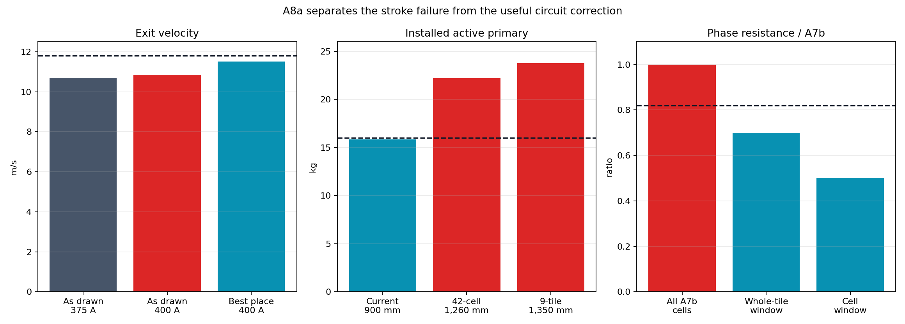

# A8a axial engagement and sectional excitation

> **Generated by `tools/make_axial_engagement.py`. Do not hand-edit.**  
> Evidence class: **EXACT INTERVAL OVERLAP + CURRENT-LIMITED KINEMATIC INTEGRATION**.
> I do not present this as transient electromagnetic FEA or measurement.

## What I found

**I found 5/10 declared bands passing, so I rejected the
as-drawn axial package.** My 336 mm cage leaves the 900 mm stator during the claimed 900 mm
powered travel.

| Configuration | Effective work distance | Exit velocity | End overlap | Outcome |
|---|---:|---:|---:|---|
| As drawn, 375 A | 0.72975 m | 10.702 m/s | 0.0% | **FAIL reference** |
| As drawn, clipped at 400 A | 0.75009 m | 10.851 m/s | 0.0% | **FAIL reference** |
| Best placement, clipped at 400 A | 0.84511 m | 11.517 m/s | 50.0% | **FAIL reference** |

My retained cage starts fully engaged, stays fully overlapped for 561.75 mm, then loses active
area linearly and reaches zero overlap before the end of travel. At fixed current that produces
only 0.72975 m of full-force-equivalent work. The 400 A ceiling
recovers just 0.148 m/s. Centring the
travel between equal 50% overlaps is the best placement, but 11.517
m/s remains below the frozen 11.8 m/s reference band.

## Why I did not simply extend Gen2.6

I found that full overlap needs a continuous stator through 1.23825
m. The first complete three-phase cell count is 42 cells at
1.26 m and
22.20 kg. Whole 150 mm modules require
9 tiles, 1.35
m and 23.79 kg. Both exceed the unchanged
16 kg active-primary band.

## What I retained

I kept the sectional-drive correction because it remains useful. My finite cage intersects at most
13 individual cells, or
4 whole 150 mm tiles. At unchanged Gen2.6
copper this bounds phase resistance at 0.50
and 0.70 times A7b. Both are below the
0.8202 ratio required to close A7b's hot-energy
corner.

I cannot use that electrical correction to rescue the physical stroke by itself. In my next
candidate I must co-design active cage length and axial position, sectional winding granularity,
installed core length and conductor area. I may reuse the five-lane transverse topology, but I
will not reuse the as-drawn 900 mm package.

I retain the complete 9,001-row trace in
`analysis/results/axial_engagement_points.csv.gz`. See the immutable
[A8a run sheet](../validation/A8a_axial_engagement.md).
