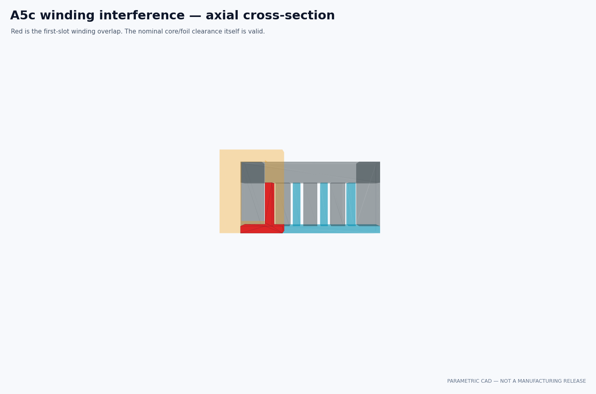

# A5c Gen1 CAD and fit gate

> **Generated by `tools/make_cad_fit.py`. Do not hand-edit.**  
> Evidence class: **PARAMETRIC CAD MANIFEST + EXACT NOMINAL SOLID INTERSECTION**. I do not present this as a
> tolerance study or manufacturing release.

## What I found

**9/10 declared bands pass.** Failed band: nominal payload stator non interference.

| Quantity | Result |
|---|---:|
| Payload envelope | 340.5 × 100.0 × 100.0 mm |
| Fluxfoil projection | 6.25 mm |
| Nominal fin clearance, each side | 0.50 mm |
| Stator face footprint / active length | 20.0 / 912.0 mm |
| Muzzle opening / frame envelope | 150.0 / 160.0 mm |
| Winding overlap, one / four faces | 3987.4 / 15949.5 mm³ |
| STEP / STL / render artifacts | 7 / 7 / 6 |

## What I found had failed

The four foil blades align in the four magnetic slots with the frozen 0.50 mm nominal clearance.
I located the failure in the winding, not the foil: the Gen1 coil envelope intrudes into the first slot by
3987.4 mm³ per face.

The CAD pass also uncovered a stronger physical contradiction outside the frozen bands. A3e asks
for 20 turns at 20.0 mm² each:
400 mm² of bare copper per cell. The 0.5 ×
12 mm inter-cell section offers only
6.0 mm² before insulation and fill
factor—a 66.7:1 deficit.

## What I decided next

**REJECT GEN1 WINDING PACKAGE AND REVISE THE MAGNETIC INTERFACE.**

The A3e electrical result remains a useful upper-level circuit calculation, but its “promote to
CAD” disposition is superseded for packaging. Bolley will not hide the mismatch with a cosmetic
coil. The next generation must cut magnetomotive force and copper section at the source, then pass
a winding-window gate before field analysis.

See the immutable [A5c run sheet](../validation/A5c_gen1_cad.md).
