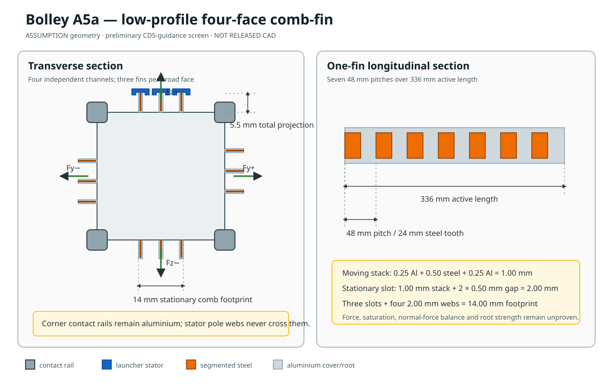

# Low-profile comb-fin interface

A3a showed why one large corner return was the wrong place to spend moving mass. The comb-fin
keeps the flux return on the launcher and changes the CubeSat only where the interface can afford
it: a thin, passive, covered structure on each broad face.

## The geometric move

One 15 mm through-flux face is divided into three 5 mm fins. Each fin is only 1.0 mm thick after
its two aluminium covers, and projects 5.5 mm from the rail plane including its radial cap. A
launcher-owned slotted stator places a pole on both sides of each fin. Because the CubeSat moves
parallel to the slots, nothing opens, closes, returns or chases it.

Across one channel:

`2 sides × 3 fins × 5 mm × 336 mm = 100.8 cm²`

That exactly preserves the A3a developed area while replacing a bulky corner yoke with three
shallow teeth. Four copies, one centred on each broad face, retain independently commanded force
lines around the payload.

## What remains standard-like

- The four corner rails remain continuous hard-anodized aluminium contact surfaces.
- The comb is centred far from the 8.5 mm rail keep-outs.
- The protrusion target remains inside the 6.5 mm CDS preliminary-design guidance.
- The spacecraft carries no winding, power switch, permanent magnet, pressure vessel or release
  command.

## What is deliberately custom

The dispenser wall contains four slotted stators and is therefore a Bolley dispenser, not an
off-the-shelf spring box. Passing CDS guidance is not provider acceptance. Coil room, back-iron,
slot tolerances, fault capture and a qualification fixture still have to be designed.

