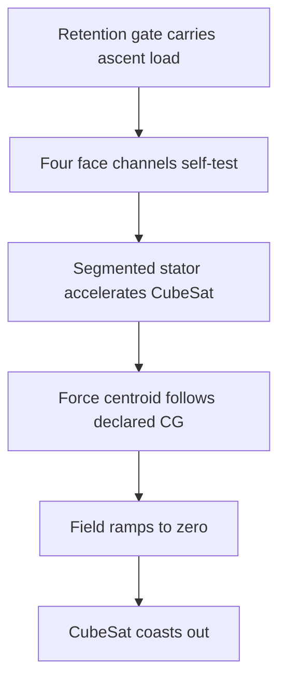

# Concept

## One change to the premise

VOLLEY accelerated an unmodified payload on a 9.445 kg reusable magnetic sled. Bolley puts a
small, passive electromagnetic reaction feature into the payload interface and eliminates the
sled.



There is no launch-member release event at the end of the stroke. Separation is the transition
from an energised stator region to free flight.

## Cooperative reaction interface

Each CubeSat force lane carries a passive reaction feature:

1. The normal dispenser contact surface remains hard-anodized aluminium.
2. The A5a primary candidate is a three-fin segmented steel comb between opposed launcher pole webs.
3. A continuous aluminium induction lane is retained if two-sided access cannot fit.
4. The reaction feature remains passive throughout integration and flight.

The launcher carries concentrated windings in independently switched 150 mm tiles. Only tiles
overlapped by the payload are energised.

The earlier buried L-shaped corner return is rejected as configured by
[`ADR-004`](adr/004-explicit-flux-path.md). [`ADR-005`](adr/005-low-profile-comb-fin.md)
promotes the shallow comb-fin to nonlinear analysis after its preliminary envelope screen. It is
still a candidate, not a released interface or provider-approved dispenser.

## Force-centroid control

Let the four rail force lines sit at `(y,z) = (+/-r,+/-r)`. For a declared transverse payload
centre of gravity `(yc,zc)`, command

```text
F(sy,sz) = Ftotal/4 * (1 + sy*yc/r) * (1 + sz*zc/r)
```

where `sy` and `sz` are `-1` or `+1`.

The four commands sum to total thrust and place its centroid at `(yc,zc)`. This removes the
single off-axis thrust line that drives VOLLEY's current clearance-impact problem. It does not
remove calibration error, rail compliance or exit fringing; those remain test problems.

## Why reluctance is the baseline

| Spacecraft-side option | Decision |
|---|---|
| Permanent magnets | Rejected: mass, continuous field and ADCS/integration burden. |
| Powered coils | Rejected: connectors, heat, inhibits and powered spacecraft hardware. |
| Conductive induction sheet | Retained as fallback: no remanence, but slip and secondary loss. |
| Passive through-flux comb-fin | Primary candidate: low moving magnetic mass and credible slotted access; force and provider fit remain unproven. |

## Two product modes

- **Bolley-R** is the active baseline: cooperative reaction rails, no returning pusher.
- **Bolley-U** is deferred: four lightweight launcher-owned fingers for an unmodified payload.

Bolley-R should be allowed to fail on its own physics before engineering effort returns to
Bolley-U.
