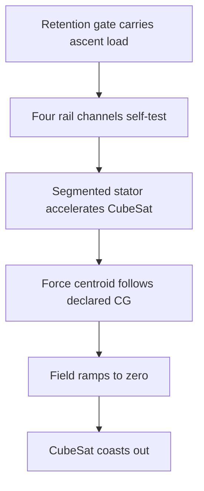

# Concept

## One change to the premise

VOLLEY accelerated an unmodified payload on a 9.445 kg reusable magnetic sled. Bolley puts a
small, passive magnetic circuit into the payload rails and eliminates the sled.



There is no launch-member release event at the end of the stroke. Separation is the transition
from an energised stator region to free flight.

## Cooperative reaction rail

Each CubeSat corner carries a hybrid rail:

1. A hard-anodized aluminium outer skin remains the dispenser contact surface.
2. Segmented non-oriented electrical steel or soft-magnetic composite forms buried translator
   poles.
3. Two orthogonal magnetic faces per corner expose enough effective air-gap area without replacing
   the standard wear surface.
4. The rail remains passive throughout integration and flight.

The launcher carries concentrated windings in independently switched 150 mm tiles. Only tiles
overlapped by the payload are energised.

## Force-centroid control

Let the four rail force lines sit at `(y,z) = (+/-r,+/-r)`. For a declared transverse payload
centre of gravity `(yc,zc)`, command

```text
F(sy,sz) = Ftotal/4 * (1 + sy*yc/r) * (1 + sz*zc/r)
```

where `sy` and `sz` are `-1` or `+1`.

The four commands sum to total thrust and place its centroid at `(yc,zc)`. This removes the
single off-axis thrust line that drives VOLLEY's current clearance-impact problem. It does not
remove calibration error, rail compliance or exit fringing; those remain test problems.

## Why reluctance is the baseline

| Spacecraft-side option | Decision |
|---|---|
| Permanent magnets | Rejected: mass, continuous field and ADCS/integration burden. |
| Powered coils | Rejected: connectors, heat, inhibits and powered spacecraft hardware. |
| Conductive induction sheet | Retained as fallback: no remanence, but slip and secondary loss. |
| Passive reluctance rails | Baseline: inexpensive translator, no electrical spacecraft interface. |

## Two product modes

- **Bolley-R** is the active baseline: cooperative reaction rails, no returning pusher.
- **Bolley-U** is deferred: four lightweight launcher-owned fingers for an unmodified payload.

Bolley-R should be allowed to fail on its own physics before engineering effort returns to
Bolley-U.

