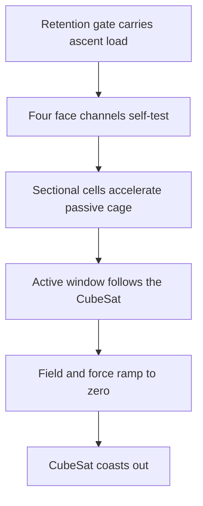

# Concept

## One change to the premise

VOLLEY accelerated an unmodified payload on a 9.445 kg reusable magnetic sled. Bolley accepts a
small passive CubeSat modification so the spacecraft itself becomes the translator. All windings,
switches, sensors and stored energy stay on the launcher.

The present architecture is **Gen2.7 Fluxrelay**, not the early reluctance comb and not the rejected
900 mm Quintweb package.



There is no launcher-owned mover to release, brake or return. Separation is the transition from
the final energized cell window to free flight.

## Cooperative reaction interface

Each CubeSat face carries five thin passive Fluxrelay lanes. A lane combines a copper ladder for
induction current with a magnetic web that provides a controlled local flux path. The interface:

- is 318.6 mm active length inside the 340.5 mm payload envelope;
- begins 2.25 mm from the aft face;
- adds 0.37136 kg in the current homogenized material model;
- contains no permanent magnets, coils, connectors, switches or stored energy; and
- remains part of the departing spacecraft.

The ordinary dispenser contact surfaces and independent ascent-load gate remain separate design
items. The passive cage does not carry launch retention by assumption.

The aluminium Fluxfoil, perforated Fluxbridge, four-lane Fluxweb and five-lane Quintweb are retained
as traceable ancestors. Their failures explain the layered cage; they are not alternative current
baselines.

## Sectional stationary primary

Each of four launcher face channels contains 27 cells at 45.3 mm pitch, giving 1.2231 m installed
active length. Four turns per cell operate at a selected 380 A RMS with 10.4 mm2 copper per turn.
The three-phase lattice repeats nine times.

The cage intersects no more than nine cells during travel. The drive therefore energizes at most
three cells per phase in each face channel. Every installed cell still counts against the 16 kg
active-primary band; only the active window contributes pulse loss and temperature in A8b.

That distinction is the mechanism that closes both earlier failures:

| Failure | Fluxrelay correction |
|---|---|
| A7b hot winding-resistance energy | Active-window phase resistance falls to 0.78725x A7b. |
| A8a cage leaves 900 mm stator | Primary length becomes 1.2231 m with 2.25 mm endpoint guards. |
| Full-overlap extension exceeds 16 kg | Cell pitch and conductor area are co-selected; installed active material is 15.908 kg. |

## Force-centroid control

Let the four face-channel force lines sit at `(y,z) = (+/-r,+/-r)`. For a declared transverse
payload centre of gravity `(yc,zc)`, command

```text
F(sy,sz) = Ftotal/4 * (1 + sy*yc/r) * (1 + sz*zc/r)
```

where `sy` and `sz` are `-1` or `+1`.

The commands sum to total thrust and place its centroid at `(yc,zc)`. This is one reason to accept
four cooperative face interfaces instead of one broad passive plate. It does not remove calibration
error, guide compliance, field mismatch or exit fringing.

## Shot sequence

1. The mechanical gate retains the CubeSat through ascent and while the electromagnetic system is
   unpowered.
2. Four face channels perform continuity, insulation, position and current-sensor checks.
3. The gate releases independently of electromagnetic thrust.
4. A moving nine-cell window commands four channel forces around the declared CG.
5. Cell handoff advances with position while inactive primary cells remain unenergized.
6. The final window ramps current and force to zero before the cage loses its 2.25 mm engagement
   guard.
7. The CubeSat coasts away; no launcher member follows it.

Steps 4–6 are control intent, not yet a switching-transient result.

## The control architecture must beat

VOLLEY A30 rejected driving on the narrow stock CDS corner rails after solving a 0.0253 transverse
edge factor. Its surviving sledless direction is a roughly 90 mm conductive plate at about 0.248 kg
in the analytical example.

Fluxrelay is heavier on the spacecraft. Its case must therefore rest on measurable system benefits:
four-channel force-centroid control, a repeatable magnetic/conductive path, less sensitivity to rail
alloy and anodization, simpler launcher guidance or lower lifecycle cost. The comparison remains
open until both branches have matched field, structural, integration and cost evidence.

## What A8b does and does not establish

A8b finds 77 analytical points that satisfy its frozen coupled bands and selects one by minimax
margin. It does not establish nonlinear field behavior at 380 A, commutation ripple, end effects,
inverter partitioning, structure, manufacturing tolerance, provider compatibility or hardware
performance. A6h and A7c are the next physics gates; Gen3 CAD is the next geometry gate.
