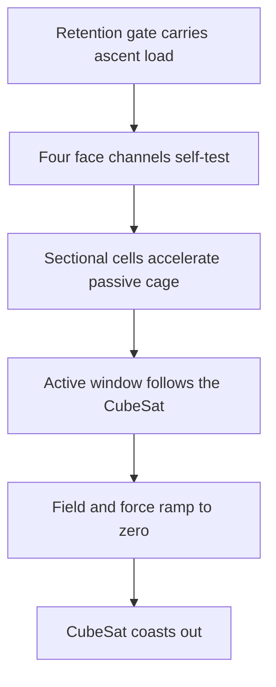

# Concept

## One change to the premise

In VOLLEY I accelerated an unmodified payload on a 9.445 kg reusable magnetic sled. In Bolley I
accept a small passive CubeSat modification so the spacecraft itself becomes the translator. I
keep all windings, switches, sensors and stored energy on the launcher.

My present architecture is the **Gen3 nominal package of Gen2.7 Fluxrelay**, not the early reluctance comb and not the rejected
900 mm Quintweb package.



I use no launcher-owned mover that must be released, braked or returned. I define separation as
the transition from the final energized cell window to free flight.

## Cooperative reaction interface

I place five thin passive Fluxrelay lanes on each CubeSat face. Each lane combines a copper ladder for
induction current with a magnetic web that provides a controlled local flux path. The interface:

- is 318.6 mm active length inside the 340.5 mm payload envelope;
- begins 2.25 mm from the aft face;
- adds 0.37136 kg in the current homogenized material model;
- contains no permanent magnets, coils, connectors, switches or stored energy; and
- remains part of the departing spacecraft.

I keep the ordinary dispenser contact surfaces and independent ascent-load gate as separate design
items. I do not assume that the passive cage carries launch retention.

I retain aluminium Fluxfoil, perforated Fluxbridge, four-lane Fluxweb and five-lane Quintweb as
traceable ancestors. Their failures explain why I built the layered cage; I do not present them as
alternative current baselines.

## Sectional stationary primary

I give each of four launcher face channels 27 cells at 45.3 mm pitch, giving 1.2231 m installed
active length. Four turns per cell operate at a selected 380 A RMS with 10.4 mm2 copper per turn.
The three-phase lattice repeats nine times.

My cage intersects no more than nine cells during travel. I therefore energize at most
three cells per phase in each face channel. Every installed cell still counts against the 16 kg
active-primary band; only the active window contributes pulse loss and temperature in A8b.

That distinction is how I close both earlier failures:

| Failure | Fluxrelay correction |
|---|---|
| A7b hot winding-resistance energy | Active-window phase resistance falls to 0.78725x A7b. |
| A8a cage leaves 900 mm stator | Primary length becomes 1.2231 m with 2.25 mm endpoint guards. |
| Full-overlap extension exceeds 16 kg | Cell pitch and conductor area are co-selected; installed active material is 15.908 kg. |

## Force-centroid control

Let the four face-channel force lines sit at `(y,z) = (+/-r,+/-r)`. For a declared transverse
payload centre of gravity `(yc,zc)`, command

```text
F(sy,sz) = Ftotal/4 * (1 + sy*yc/r) * (1 + sz*zc/r)
```

where I take `sy` and `sz` as `-1` or `+1`.

My commands sum to total thrust and place its centroid at `(yc,zc)`. This is one reason I accept
four cooperative face interfaces instead of one broad passive plate. I do not claim that it removes
calibration error, guide compliance, field mismatch or exit fringing.

## Shot sequence

1. The mechanical gate retains the CubeSat through ascent and while the electromagnetic system is
   unpowered.
2. Four face channels perform continuity, insulation, position and current-sensor checks.
3. The gate releases independently of electromagnetic thrust.
4. A moving nine-cell window commands four channel forces around the declared CG.
5. Cell handoff advances with position while inactive primary cells remain unenergized.
6. The final window ramps current and force to zero before the cage loses its 2.25 mm engagement
   guard.
7. The CubeSat coasts away; no launcher member follows it.

I record steps 4–6 as control intent, not as a switching-transient result.

## The control architecture must beat

In VOLLEY A30 I rejected driving on the narrow stock CDS corner rails after solving a 0.0253 transverse
edge factor. Its surviving sledless direction is a roughly 90 mm conductive plate at about 0.248 kg
in the analytical example.

Fluxrelay is heavier on the spacecraft. I therefore require it to earn that mass through measurable system benefits:
four-channel force-centroid control, a repeatable magnetic/conductive path, less sensitivity to rail
alloy and anodization, simpler launcher guidance or lower lifecycle cost. The comparison remains
open until I have matched field, structural, integration and cost evidence for both branches.

## What I established in A8b, A6h and A7c

In A8b I found 77 analytical points that satisfy my frozen coupled bands and selected one by minimax
margin. In A6h I replaced its field and inductance surrogates at the exact selected point. Three
fresh nonlinear meshes pass all 13 frozen bands, and I now carry a 4.81156 uH phase-window
inductance into my circuit model. In A7c I reclosed all four robustness corners from that result;
every corner passes all 29 bands, with a controlling 893.412 J reference shot.

In A5e I converted that exact point into a controlled Gen3 nominal assembly. All 17 frozen bands
pass, with zero nominal solid interference, volume-matched windings and 2.25 mm endpoint guard.

I have not established commutation ripple, end effects, inverter partitioning, structure,
manufacturing tolerance, provider compatibility or hardware performance. A9 transient
sectional-drive work is my next physics gate; toleranced structure and packaged mass are my next
geometry and integration gates.
