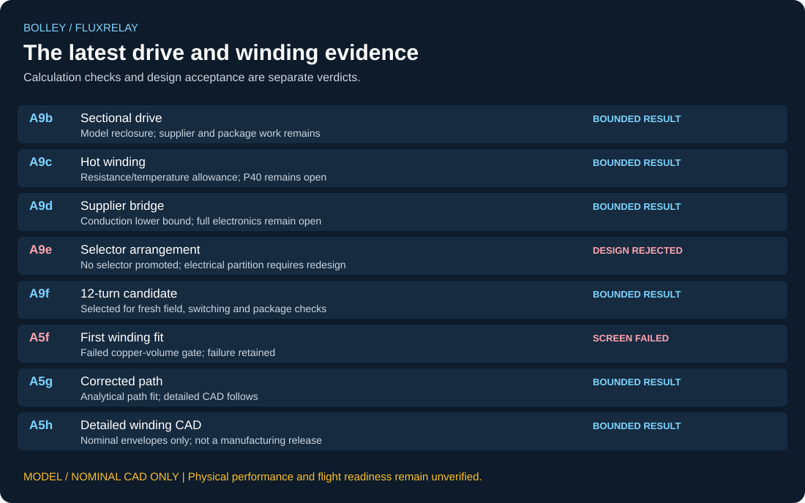

# Current Fluxrelay review

I generate this review from the committed result files with `tools/make_review_snapshot.py`.
It supplements the historical [run status](../validation/STATUS.md) with the later drive and winding sequence.
A passing screen means its declared calculation checks passed. The design disposition can still be a rejection.
Nothing here is hardware evidence.

| Run | Screen checks | Design disposition | Remaining boundary |
|---|---|---|---|
| [A9b](../validation/A9b_sectional_drive_residual_reclosure.md) | PASS | `A9B_PASS_RETAIN_FLUXRELAY_FOR_SUPPLIER_AND_PACKAGING_CLOSURE` | Model reclosure; supplier and package work remains |
| [A9c](../validation/A9c_hot_winding_margin.md) | PASS | `A9C_TARGET_DEFINED_P40_REMAINS_OPEN` | Resistance/temperature allowance; P40 remains open |
| [A9d](../validation/A9d_supplier_bridge_lower_bound.md) | PASS | `A9D_LOWER_BOUND_SURVIVES_P11_P39_P40_REMAIN_OPEN` | Conduction lower bound; full electronics remain open |
| [A9e](../validation/A9e_selector_realization_lower_bound.md) | PASS | `A9E_NO_SELECTOR_PROMOTED_SECTIONAL_PARTITION_REQUIRES_REDESIGN` | No selector promoted; electrical partition requires redesign |
| [A9f](../validation/A9f_turn_current_exchange.md) | PASS | `A9F_SELECT_12TURN_LOCAL_BRIDGE_FOR_FRESH_FIELD_CAD_AND_SWITCHING_CLOSURE` | Selected for fresh field, switching and package checks |
| [A5f](../validation/A5f_gen3_12turn_winding.md) | FAIL | `A5F_FAIL_FIXED_INNER_SPANS_EXCEED_A5E_COPPER_VOLUME` | Failed copper-volume gate; failure retained |
| [A5g](../validation/A5g_gen3_12turn_path.md) | PASS | `A5G_PASS_PROMOTE_SELECTED_12TURN_WINDING_TO_DETAILED_CAD` | Analytical path fit; detailed CAD follows |
| [A5h](../validation/A5h_gen3_12turn_detailed_cad.md) | PASS | `10/10 nominal-CAD bands` | Nominal envelopes only; not a manufacturing release |
| [A9g](../validation/A9g_selected_winding_reclosure.md) | PASS | `BOUNDED_RECLOSURE_ONLY_HOT_SWITCHING_AND_FIELD_OPEN` | Six of sixteen assumed loss corners pass; hot switching remains open |

## The selected electrical screen

These A9f values use the declared scaling and supplier conduction assumptions. They do not include a complete hot switching implementation.

| Quantity | Model output |
|---|---:|
| Turns per cell | 12 |
| Rated phase current | 126.667 A |
| Reference source energy | 889.719 J |
| Qualification source energy | 1296.786 J |
| Healthy required DC link | 42.448 V |
| Failed-cell required DC link | 45.023 V |
| Supplier modules | 108 |
| Module-only mass | 2.5488 kg |

A9c's earlier configuration has 2.252 J remaining below its reference cap,
equivalent to only 2.669 C beyond its inherited hot-winding corner under that model.
That is not the margin of the later A9f candidate; the configurations must stay separate.

## Selected-partition reclosure

[A9g](SELECTED_WINDING_RECLOSURE.md) reruns the ideal-current handoff model at twelve turns.
It reproduces the current/voltage/energy scaling at two resolutions. The selected 25 C
conduction point leaves 10.280918 J below the reference cap; only six of sixteen assumed
conduction/additional-loss corners pass. This does not close the actual winding field or hot switching.

## What I would close next

1. Check RMS, peak, internal-path and package current definitions against the supplier data before crediting a device rating.
2. Re-solve the field/current distribution for the actual A5h winding, including terminals and lead routing.
3. Couple hot conduction, switching, parasitics, protection, supply sag and thermal paths across the full campaign.
4. Carry the lane gap and guide alignment through manufacturing, thermal and dynamic tolerances.
5. Close installed mass and six-degree-of-freedom release/fault behaviour before a full-system prototype design review.

The [completion standard](COMPLETION_STANDARD.md) still applies. The shared
[prototype programme](https://github.com/aaaaaaaaaaaavm/VOLLEY/blob/main/docs/PROTOTYPE_READINESS.md)
defines the intended build package and the dependency order. These are open work, not newly passed gates.

## Reproduction and provenance

Run `python tools/make_review_snapshot.py --check` to check these surfaces against their source files.
This does not rerun the physical analyses. `python tools/check_repo.py` checks the existing repository pipeline;
full solver and CAD reconstruction remain distinct from artifact checks.

| Source | SHA-256 |
|---|---|
| [sectional_drive_a9b.json](../analysis/results/sectional_drive_a9b.json) | `3c6b148d7253a9aa5a0b818457fede01ba415ec64c2daed3f83ce25a08c3e039` |
| [hot_winding_margin.json](../analysis/results/hot_winding_margin.json) | `cb2cc352b87c40492550b5a4b7dbc36b30ae2287cb49319ad2552e9090e20fa1` |
| [supplier_bridge_screen.json](../analysis/results/supplier_bridge_screen.json) | `262ce460c7d1d4f34583348cb97e0a27340c47bcfcf35f04a639c988a42dbced` |
| [selector_realization_screen.json](../analysis/results/selector_realization_screen.json) | `d9104b77bf02371a92a33325050730560dea313ddf17836b8999470d7c4d681b` |
| [turn_current_exchange.json](../analysis/results/turn_current_exchange.json) | `1f7ffdef6d243df410ce3105c57eac5a67b94b9e38ceea16522f3a4c57113afa` |
| [gen3_12turn_winding_fit.json](../analysis/results/gen3_12turn_winding_fit.json) | `47071563ff780121df93f60e681b10804d851c5fc803e78be9cc133737016203` |
| [gen3_12turn_path_fit.json](../analysis/results/gen3_12turn_path_fit.json) | `acec4ff5676548029850eab267052d3e3010814567c9c3283e0dbe6d2a6034fc` |
| [gen3_12turn_detailed_fit.json](../analysis/results/gen3_12turn_detailed_fit.json) | `97372bbd548839fb808c40919811bbe526518a2425d0ff1d497ba6b0e6896962` |
| [selected_winding_reclosure.json](../analysis/results/selected_winding_reclosure.json) | `ef748f521e0f44e4ef2b3df5e6455a28cb892c21e82cb8d3d3a51363289f9ed2` |
