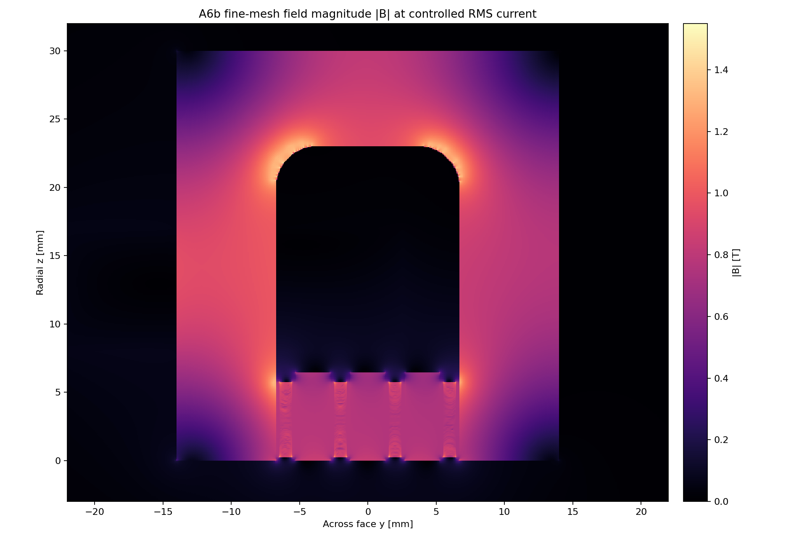
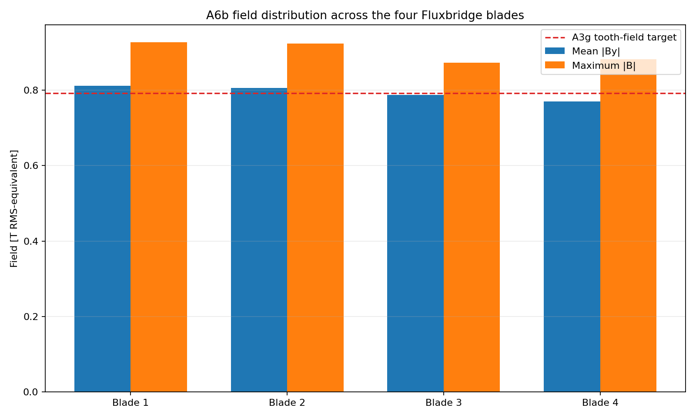
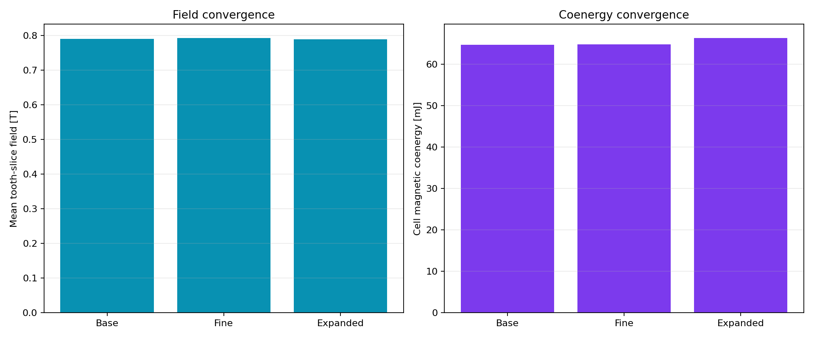

# A6b Gen2.1 Fluxmanifold field gate

> **Generated by `tools/make_gen21_field.py`. Do not hand-edit.**  
> Evidence class: **INDEPENDENTLY MESHED 2D NONLINEAR RMS-EQUIVALENT MAGNETOSTATIC FEA**.
> I treat this as model evidence, not measured field or force.

## What I found

**11/13 declared bands pass.** Failed bands: magnetic ligament field, stationary core field.

| Quantity | Fine-mesh result | Frozen band | Outcome |
|---|---:|---:|---:|
| Base-to-fine mean-field change | 0.261% | <=2.000% | PASS |
| Base-to-fine coenergy change | 0.216% | <=4.000% | PASS |
| Expanded-boundary mean-field change | 0.181% | <=2.000% | PASS |
| Mean tooth-slice field | 0.7934 T | 0.7200–0.8600 T | PASS |
| Four-slot flux imbalance | 3.007% | <=5.000% | PASS |
| Active-height field CV | 4.408% | <=15.000% | PASS |
| Inferred ligament peak | 1.4820 T | <=1.4500 T | **FAIL** |
| Stationary-core peak | 1.5595 T | <=1.5500 T | **FAIL** |
| Stationary-core area-weighted p99 | 1.2251 T | diagnostic | — |
| Per-cell inductance ratio to A3g | 0.8768 | 0.6800–1.0500 | PASS |
| Source-current residual | 0.000e+00 | <=1.000e-10 | PASS |
| Final nonlinear solution change | 8.220e-05 | <=1.000e-4 | PASS |

The fine mesh contains 373,752 nodes and 745,030 triangles. It
converges in 18 nonlinear updates.

## What I changed after A6

Fluxmanifold repairs the main Gen2 failure. Mean field rises from 0.6568 to
0.7934 T. Core p99 falls from 1.5950 to
1.2251 T. The three-turn per-cell inductance is
0.7129 µH, inside its new frozen band. The radius-fed return is a
real improvement, not a relabelled A6 point.

It is not yet promotable. The fine moving-ligament estimate exceeds its limit by
2.21%, and the return-haunch peak exceeds its
limit by 0.62%. Those small misses are resolved
on a numerically converged solution and remain failures.

## What I decided next

**DO NOT PROMOTE GEN21 FLUXMANIFOLD.**

Gen2.1 is retained as evidence that the manifold and turn exchange work, but its exact geometry
is rejected. Gen2.2 must reduce MMF and add genuine haunch area while remaining above the same
0.72 T field floor. No transient force, drive or CAD claim advances from A6b.

See the immutable [A6b run sheet](../validation/A6b_gen21_fluxmanifold.md).
