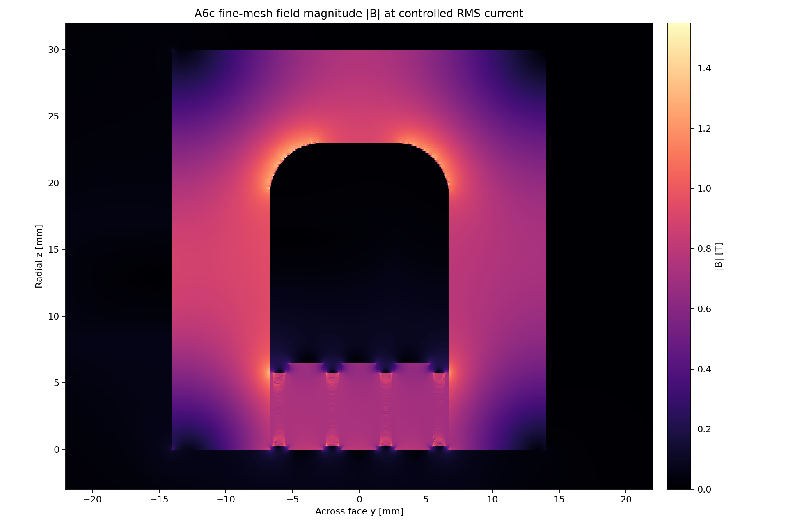
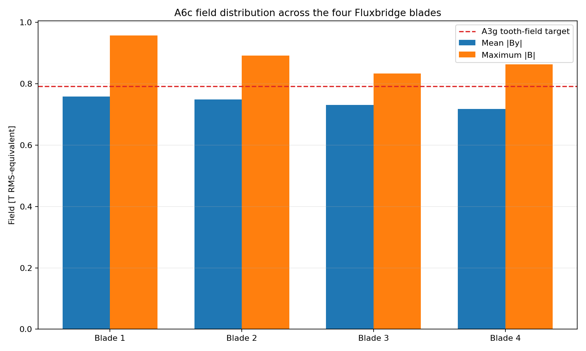
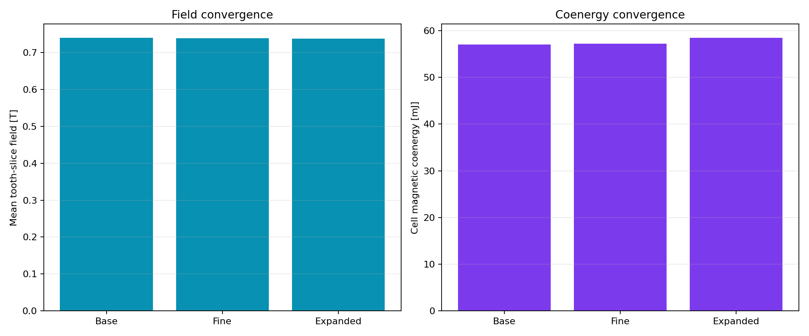

# A6c Gen2.2 Fluxmanifold-R4 field gate

> **Generated by `tools/make_gen22_field.py`. Do not hand-edit.**  
> Evidence class: **THREE-MESH 2D NONLINEAR RMS-EQUIVALENT MAGNETOSTATIC FEA**.
> I evaluate physical bands with the worst of all three meshes. I do not present this as measured field or force.

## What I found

**12/13 declared bands pass.** Failed band: magnetic ligament field.

| Quantity | Controlled result | Frozen band | Outcome |
|---|---:|---:|---:|
| Base-to-fine mean-field change | 0.107% | <=2.000% | PASS |
| Base-to-fine coenergy change | 0.315% | <=4.000% | PASS |
| Expanded-boundary mean-field change | 0.310% | <=2.000% | PASS |
| Worst-mesh mean-field range | 0.7372–0.7395 T | 0.7200–0.8600 T | PASS |
| Worst slot-flux imbalance | 3.205% | <=5.000% | PASS |
| Worst active-height field CV | 4.351% | <=15.000% | PASS |
| Worst inferred ligament peak | 1.5306 T | <=1.4500 T | **FAIL** |
| Worst stationary-core peak | 1.4113 T | <=1.5500 T | PASS |
| Fine per-cell inductance ratio to A3g | 0.8797 | 0.6800–1.0500 | PASS |
| Worst source-current residual | 1.895e-16 | <=1.000e-10 | PASS |
| Worst final nonlinear solution change | 9.736e-05 | <=1.000e-4 | PASS |

## What I decided next

Fluxmanifold-R4 fixes the launcher return: worst stationary peak is
1.4113 T, with fine core p99 only
1.1204 T. Field, balance, uniformity, inductance and every
numerical check pass. The single failure is the moving rib at
1.5306 T.

**DO NOT PROMOTE GEN22 FLUXMANIFOLD R4.** Gen2.2 is not promoted. Gen2.3 must add passive magnetic
cross-section without shrinking the copper rung duty, then rerun this same worst-mesh gate.

See the immutable [A6c run sheet](../validation/A6c_gen22_fluxmanifold_r4.md).
