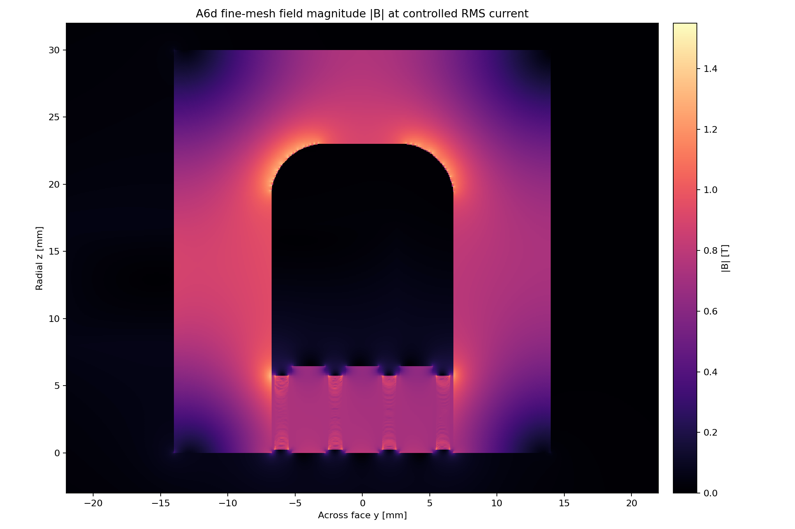
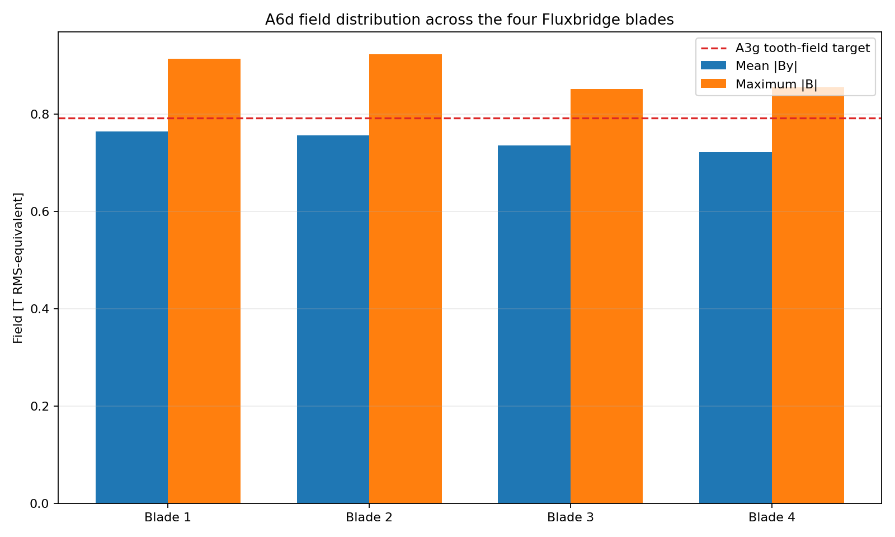
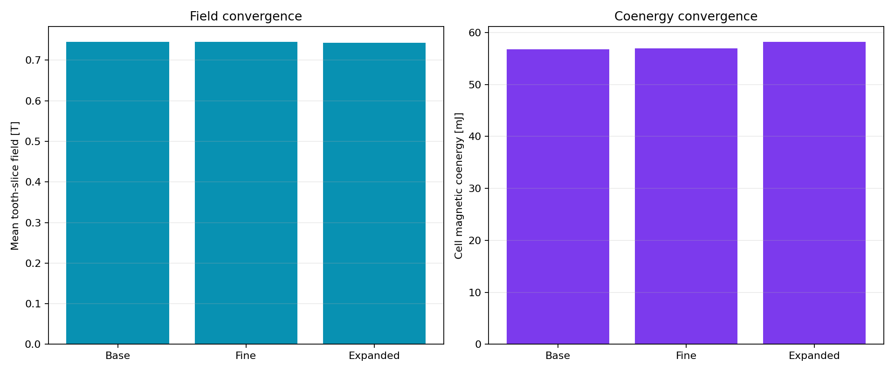

# A6d Gen2.3 Fluxrib field gate

> **Generated by `tools/make_gen23_field.py`. Do not hand-edit.**  
> Evidence class: **THREE-MESH 2D NONLINEAR RMS-EQUIVALENT MAGNETOSTATIC FEA**.
> Physical bands use the worst of all three meshes. This is not measurement or force evidence.

## Result

**12/13 declared bands pass.** Failed band: magnetic ligament
field.

| Quantity | Controlled result | Frozen band | Outcome |
|---|---:|---:|---:|
| Base-to-fine mean-field change | 0.059% | <=2.000% | PASS |
| Base-to-fine coenergy change | 0.289% | <=4.000% | PASS |
| Boundary mean-field change | 0.308% | <=2.000% | PASS |
| Worst-mesh mean-field range | 0.7430–0.7453 T | 0.7200–0.8600 T | PASS |
| Worst slot imbalance / height CV | 3.030% / 4.744% | <=5% / <=15% | PASS |
| Worst inferred ligament peak | 1.4766 T | <=1.4500 T | **FAIL** |
| Worst stationary-core peak | 1.4598 T | <=1.5500 T | PASS |
| Fine inductance ratio to A3g | 0.8755 | 0.6800–1.0500 | PASS |
| Worst source / nonlinear closure | 1.895e-16 / 9.831e-05 | <=1e-10 / <=1e-4 | PASS |

The 14.23 g rib thickening reduces the worst ligament estimate from A6c's 1.5306 T to
1.4766 T, but that remains
1.83% above the frozen limit.
Everything else passes, including the field floor and the R4 return.

## Disposition

**DO NOT PROMOTE GEN23 FLUXRIB.** A6d remains failed. The next rib may exceed the old
0.30 kg preferred interface mass, but must remain below the unchanged 0.40 kg absolute limit and
must keep copper rung geometry intact.

See the immutable [A6d run sheet](../validation/A6d_gen23_fluxrib.md).
