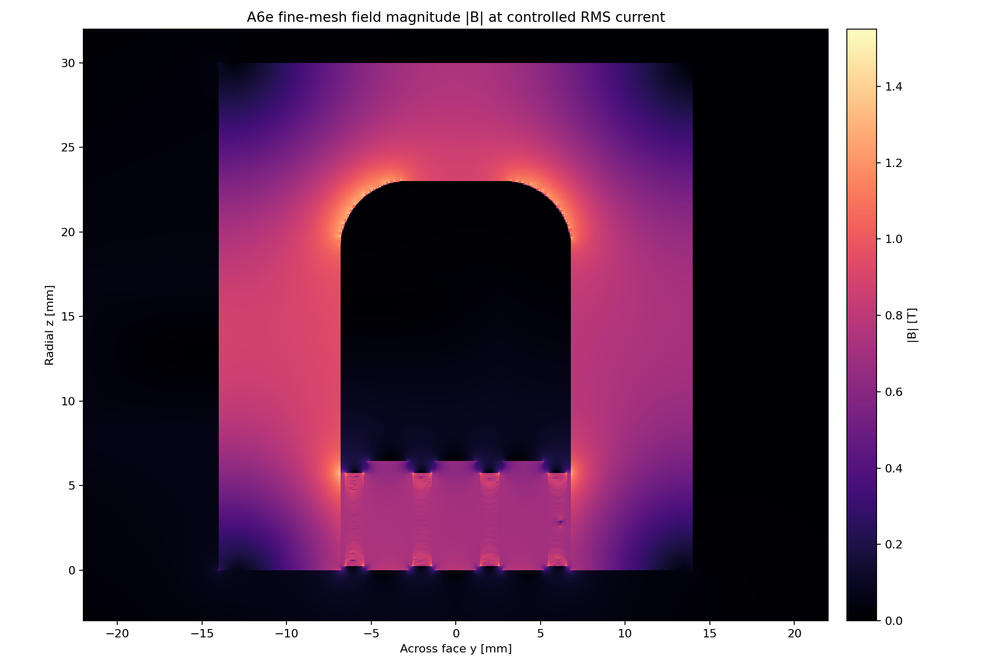
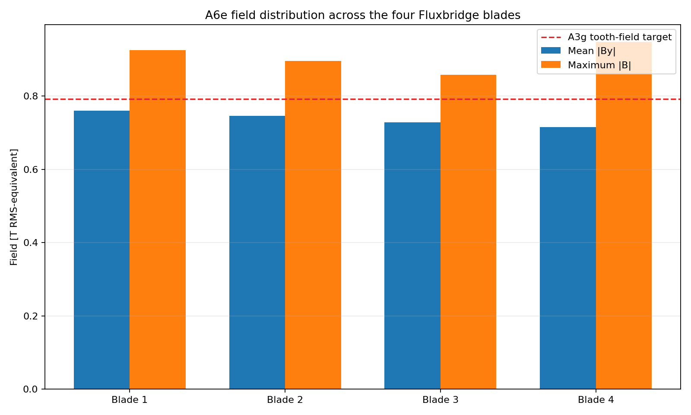
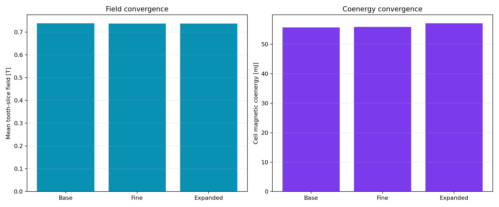

# A6e Gen2.4 Fluxrib field gate

> **Generated by `tools/make_gen24_field.py`. Do not hand-edit.**  
> Evidence class: **THREE-MESH 2D NONLINEAR RMS-EQUIVALENT MAGNETOSTATIC FEA**.
> Physical bands use the worst of all three meshes. This is not measurement or force evidence.

## Result

**12/13 declared magnetic bands pass.** Failed band: magnetic
ligament field. The separate 0.30 kg interface preference is also missed as declared.

| Quantity | Controlled result | Frozen band | Outcome |
|---|---:|---:|---:|
| Base-to-fine mean-field change | 0.184% | <=2.000% | PASS |
| Base-to-fine coenergy change | 0.298% | <=4.000% | PASS |
| Boundary mean-field change | 0.136% | <=2.000% | PASS |
| Worst-mesh mean-field range | 0.7376–0.7390 T | 0.7200–0.8600 T | PASS |
| Worst slot imbalance / height CV | 3.065% / 4.985% | <=5% / <=15% | PASS |
| Worst inferred ligament peak | 1.5159 T | <=1.4500 T | **FAIL** |
| Worst stationary-core peak | 1.4449 T | <=1.5500 T | PASS |
| Fine inductance ratio to A3g | 0.8736 | 0.6800–1.0500 | PASS |
| Worst source / nonlinear closure | 3.821e-16 / 9.691e-05 | <=1e-10 / <=1e-4 | PASS |
| Interface increment | 0.30860 kg | preferred <=0.30000 kg | **FAIL** |
| Interface increment | 0.30860 kg | absolute <=0.40000 kg | PASS |

The bulk quantities are stable: all declared numerical differences are below 0.30%. The controlling
maximum is not. Base, expanded and fine ligament estimates rise from
1.3942 to
1.4729 to
1.5159 T. Uniform rib thickening has
therefore not removed the local entry concentration.

## Disposition

**DO NOT PROMOTE GEN24 FLUXRIB.** Gen2.4 remains failed. The next correction must change how
magnetic and conductive duties share the blade, rather than buying another uniform thickness
increment or relaxing the 1.45 T band.

See the immutable [A6e run sheet](../validation/A6e_gen24_fluxrib.md).
