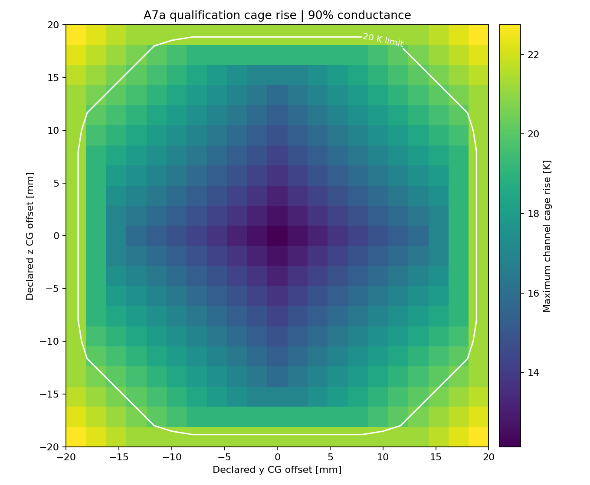
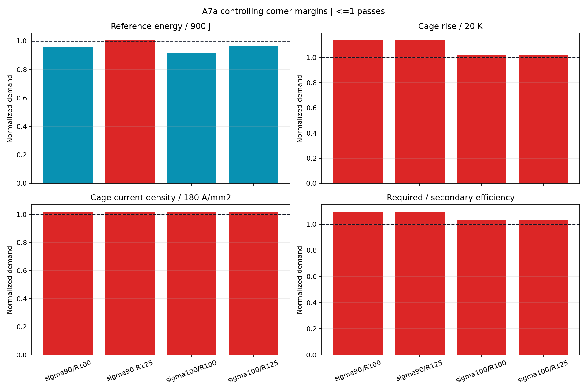

# A7a Gen2.5 cage/circuit reclosure

> **Generated by `tools/make_gen25_cage_circuit.py`. Do not hand-edit.**  
> Evidence class: **POST-FIELD HOMOGENIZED CAGE + LUMPED CIRCUIT/CG SHOT MODEL**.
> This is not transient field FEA or measurement.

## Result

**No robustness corner passes all 19 bands.** The failed-band union is: cage copper rise, cage
current density, reference source energy and secondary-only efficiency.

| Quantity | Worst A7a result | Frozen band | Outcome |
|---|---:|---:|---:|
| Reference source energy | 905.1 J | <=900 J | **FAIL** |
| Qualification source energy | 1325.0 J | <=1,500 J | PASS |
| Source-to-payload efficiency | 33.64% | >=30% | PASS |
| Secondary-only efficiency | 45.66% | >=50% | **FAIL** |
| Cage copper rise | 22.74 K | <=20 K | **FAIL** |
| Cage current density | 183.30 A/mm2 | <=180 A/mm2 | **FAIL** |
| Cage slip | 7.073 m/s | <=8 m/s | PASS |
| Required DC link | 15.37 V | <=48 V and >=10% margin | PASS |
| Peak DC power | 11.84 kW | <=15 kW | PASS |
| Primary copper rise | 0.101 K | <=3 K | PASS |
| Terminal frequency | 210.6 Hz | <=350 Hz | PASS |
| Interface mass | 0.31059 kg | <=0.40 kg | PASS |

The failure is on the passive translator, not the drive. Voltage has more than 200% margin,
primary heat is negligible at this shot duration and worst power is below 12 kW. At the controlling
90% conductance corner, however, 7.073 m/s slip leaves only 45.66% secondary efficiency and drives
the qualification cage 2.74 K above its limit. The hot-resistance corner then pushes the reference
shot 5.1 J beyond the 900 J kill criterion.

## Disposition

**DO NOT PROMOTE GEN25 CAGE CIRCUIT POINT.** Keep the A6f field pass but reject the exact Gen2.5
cage/circuit point. The next change must lower force per conductive area or add conductor without
erasing the Fluxweb's magnetic continuity. Current and threshold increases are not the remedy.

The complete 3,528-point table is retained in
`analysis/results/gen25_cage_circuit_points.csv.gz`.

See the immutable [A7a run sheet](../validation/A7a_gen25_cage_circuit.md).
