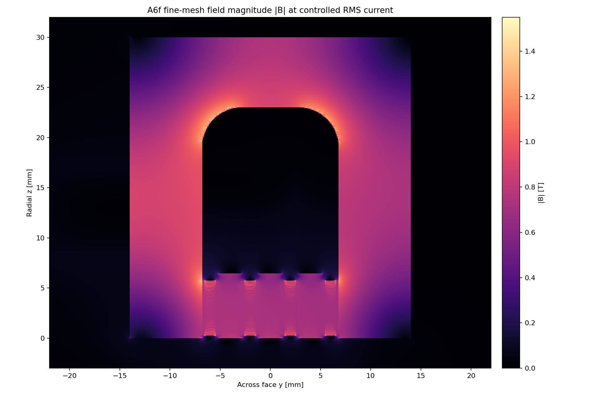
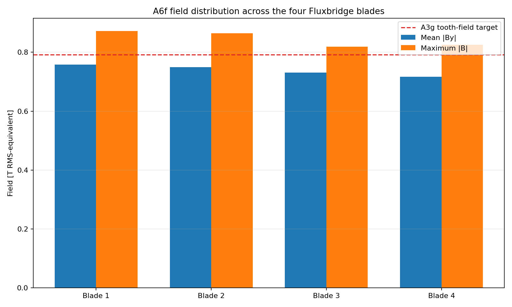
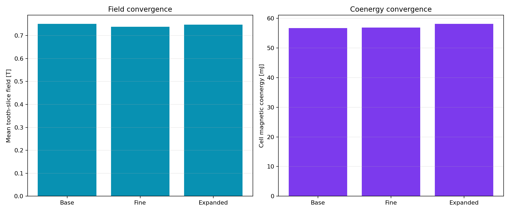

# A6f Gen2.5 Fluxweb field gate

> **Generated by `tools/make_gen25_field.py`. Do not hand-edit.**  
> Evidence class: **THREE-MESH 2D NONLINEAR RMS-EQUIVALENT MAGNETOSTATIC FEA**.
> I evaluate physical bands with the worst of all three meshes. I do not present this as measurement, transient cage or
> force evidence.

## What I found

**13/13 declared magnetic bands pass.** The separate 0.30 kg
interface preference remains failed as declared.

| Quantity | Controlled result | Frozen band | Outcome |
|---|---:|---:|---:|
| Base-to-fine mean-field change | 1.758% | <=2.000% | PASS |
| Base-to-fine coenergy change | 0.347% | <=4.000% | PASS |
| Boundary mean-field change | 0.409% | <=2.000% | PASS |
| Worst-mesh mean-field range | 0.7383–0.7513 T | 0.7200–0.8600 T | PASS |
| Worst slot imbalance | 3.922% | <=5.000% | PASS |
| Worst active-height CV | 7.119% | <=15.000% | PASS |
| Worst inferred magnetic-material peak | 1.4009 T | <=1.4500 T | PASS |
| Worst stationary-core peak | 1.4652 T | <=1.5500 T | PASS |
| Fine inductance ratio to A3g | 0.8743 | 0.6800–1.0500 | PASS |
| Worst source residual | 1.895e-16 | <=1e-10 | PASS |
| Worst final nonlinear change | 9.945e-05 | <=1e-4 | PASS |
| Interface increment | 0.31059 kg | preferred <=0.30000 kg | **FAIL** |
| Interface increment | 0.31059 kg | absolute <=0.40000 kg | PASS |

The 0.20 mm magnetic backstrap closes the failure without another external-width increment. The
worst magnetic-material estimate is 1.4009 T,
3.39% below its limit. The trade is
real: equivalent cage copper falls to 0.345 mm
and the interface preference is missed by 10.59 g.

## What I decided next

**PROMOTE GEN25 FLUXWEB TO CAGE CIRCUIT CAD AND TRANSIENT FORCE CLOSURE.** This promotes the Fluxweb only to new cage/circuit,
discrete CAD and transient-force gates. It does not validate the layered joint or the machine.

I do not treat this as a loose pass. Base-to-fine mean field changes
1.758% against 2%, and worst nonlinear
closure is 9.945e-05 against 1e-4. The next field model
must resolve the axial bar/backstrap pattern rather than treating this 2D homogenization as final.

See the immutable [A6f run sheet](../validation/A6f_gen25_fluxweb.md).
