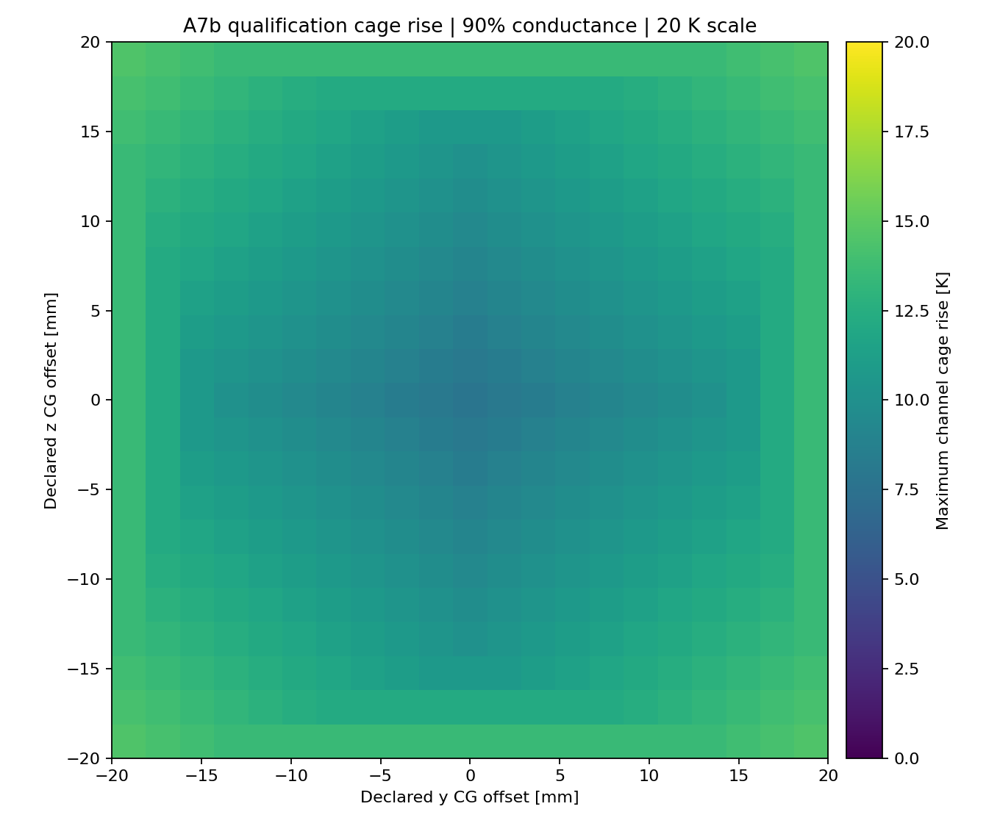
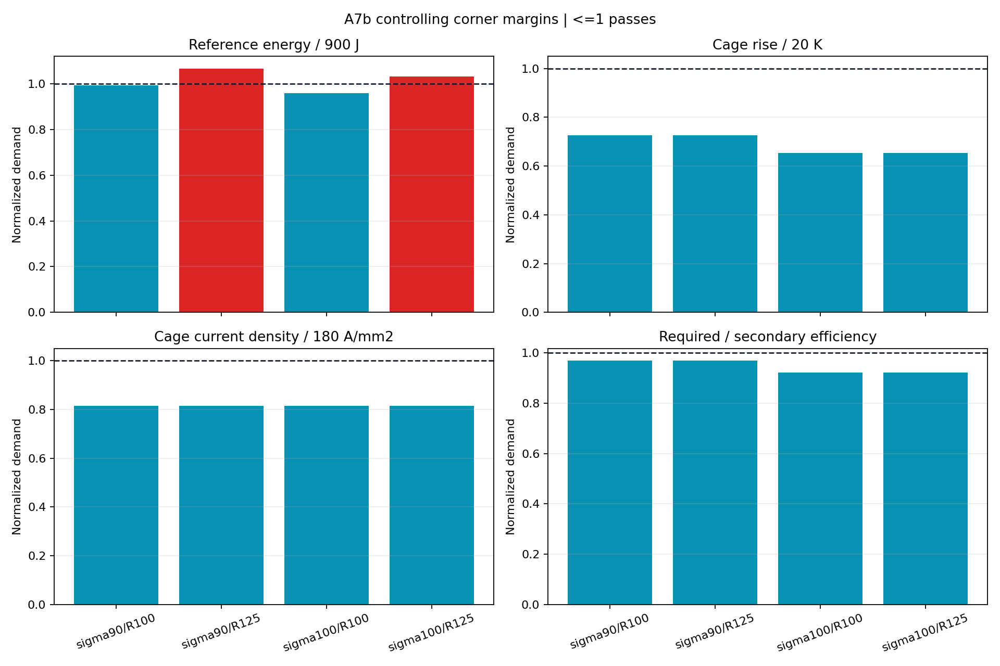

# A7b Gen2.6 Quintweb cage/circuit reclosure

> **Generated by `tools/make_gen26_cage_circuit.py`. Do not hand-edit.**  
> Evidence class: **POST-FIELD HOMOGENIZED CAGE + LUMPED CIRCUIT/CG SHOT MODEL**.
> I do not present this as transient field FEA or measurement.

## What I found

**I found 2/4 robustness corners passing all 19 bands.** Both of my 100%
phase-resistance corners pass. Both 125% phase-resistance corners fail only my reference
source-energy band.

| Quantity | Worst A7b result | Frozen band | Outcome |
|---|---:|---:|---:|
| Reference source energy | 959.9 J | <=900 J | **FAIL** |
| Qualification source energy | 1397.4 J | <=1,500 J | PASS |
| Source-to-payload efficiency | 32.29% | >=30% | PASS |
| Secondary-only efficiency | 51.58% | >=50% | PASS |
| Cage copper rise | 14.53 K | <=20 K | PASS |
| Cage current density | 146.51 A/mm2 | <=180 A/mm2 | PASS |
| Cage slip | 5.579 m/s | <=8 m/s | PASS |
| Required DC link | 18.24 V | <=48 V and >=10% margin | PASS |
| Peak DC power | 12.35 kW | <=15 kW | PASS |
| Primary copper rise | 0.159 K | <=3 K | PASS |
| Terminal frequency | 194.1 Hz | <=350 Hz | PASS |
| Interface mass | 0.38823 kg | <=0.40 kg | PASS |

I found that Quintweb closes every translator-side failure from A7a. At 90% cage conductance, maximum cage
rise falls from 22.74 K to 14.53 K, current density from 183.30 to
146.51 A/mm2 and slip from 7.073 to 5.579 m/s. Minimum secondary
efficiency rises from 45.66% to 51.58%.

My remaining miss is now on the stationary primary. The controlling 90%-conductance reference
corner uses 893.3 J at nominal phase resistance and 959.9 J at 125%.
The paired-corner difference isolates 266.6 J of nominal-resistance
source energy and 626.7 J independent of that resistance. With all
other A7b quantities fixed, the nominal phase resistance must therefore fall to at most
82.02% of A7b, equivalent to at least 21.93% more
effective copper area at unchanged turn length. That is a development diagnostic, not a frozen
Gen2.7 design.

## What I decided next

**DO NOT PROMOTE GEN26 QUINTWEB CAGE CIRCUIT POINT.** I preserved the A6g field solution and the five-lane
translator. I rejected the exact Gen2.6 circuit point because my robustness claim requires all
four corners. I placed the next controlled change on the stationary launcher winding; adding
payload mass, raising current or moving my 900 J band would address the wrong failure.

I retain the complete 3,528-point table in
`analysis/results/gen26_cage_circuit_points.csv.gz`.

See the immutable [A7b run sheet](../validation/A7b_gen26_cage_circuit.md).
