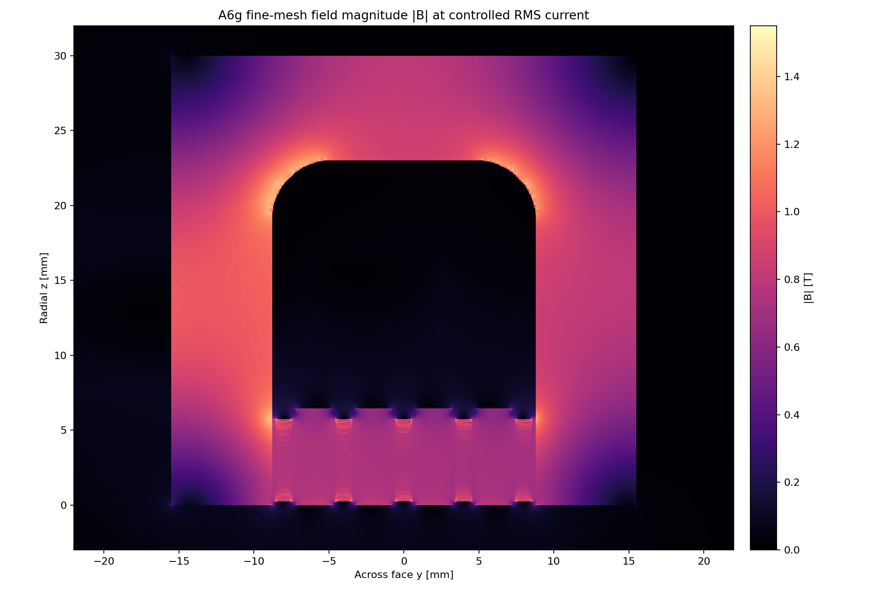
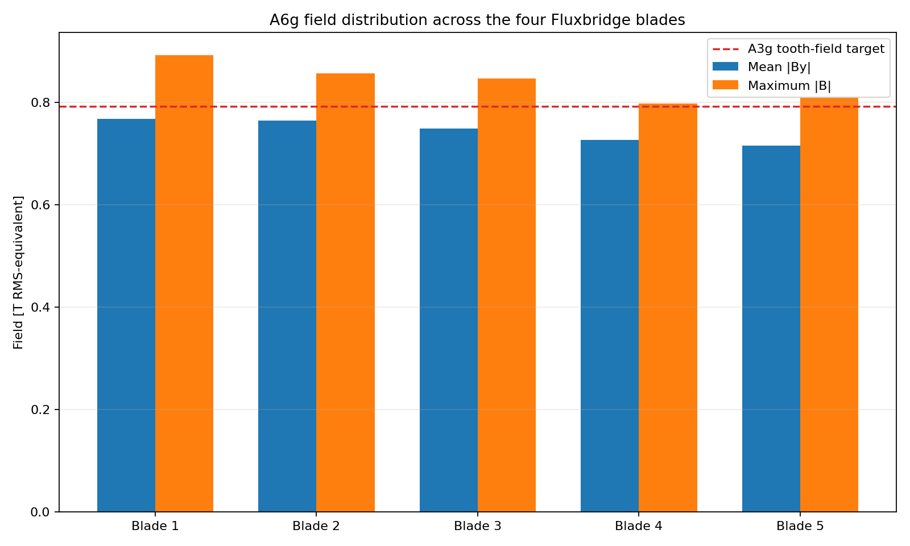
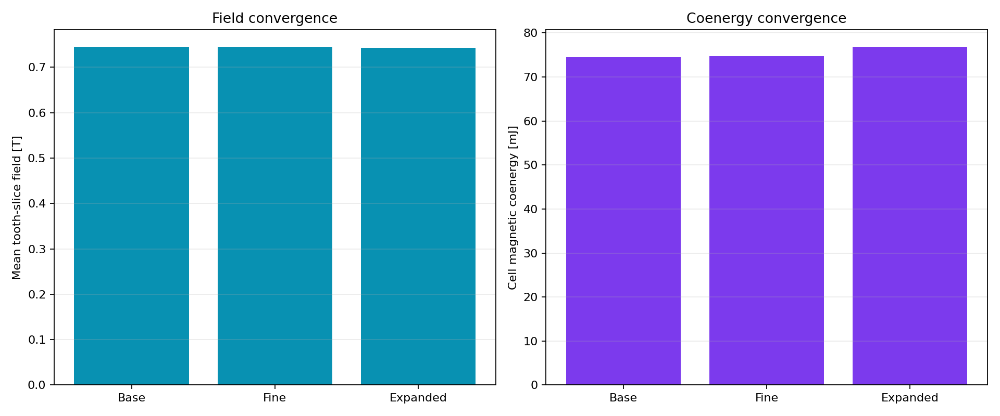

# A6g Gen2.6 Quintweb field gate

> **Generated by `tools/make_gen26_field.py`. Do not hand-edit.**  
> Evidence class: **THREE-MESH 2D NONLINEAR RMS-EQUIVALENT MAGNETOSTATIC FEA**.
> Physical bands use the worst of all three meshes. This is not measurement or force evidence.

## Result

**13/13 declared magnetic bands pass.** The payload mass target
and preference fail; the absolute mass limit passes narrowly.

| Quantity | Controlled result | Frozen band | Outcome |
|---|---:|---:|---:|
| Base-to-fine mean-field change | 0.070% | <=2.000% | PASS |
| Base-to-fine coenergy change | 0.266% | <=4.000% | PASS |
| Boundary mean-field change | 0.375% | <=2.000% | PASS |
| Worst-mesh mean-field range | 0.7426–0.7454 T | 0.7200–0.8600 T | PASS |
| Worst slot imbalance / height CV | 4.253% / 4.434% | <=5% / <=15% | PASS |
| Worst moving-material peak | 1.2888 T | <=1.4500 T | PASS |
| Worst stationary-core peak | 1.5138 T | <=1.5500 T | PASS |
| Fine inductance ratio to A3g | 1.3062 | 0.6800–1.4000 | PASS |
| Worst source / nonlinear closure | 3.032e-16 / 9.882e-05 | <=1e-10 / <=1e-4 | PASS |
| Interface increment | 0.38823 kg | absolute <=0.40000 kg | PASS |

The fifth blade does what A7a needed without breaking the field. Moving-material peak is
11.12% below its limit and all three
mesh means remain more than 3.14% above the
floor. The stationary return is closer: 1.5138 T leaves
36.2 mT.

## Disposition

**PROMOTE GEN26 QUINTWEB TO CAGE CIRCUIT AND CAD CLOSURE.** A6g opens A7b and Gen3 CAD; it does not close either.
The pass has only 11.77 g of geometric payload-mass
margin, and worst nonlinear closure is 9.882e-05.

See the immutable [A6g run sheet](../validation/A6g_gen26_quintweb.md).
