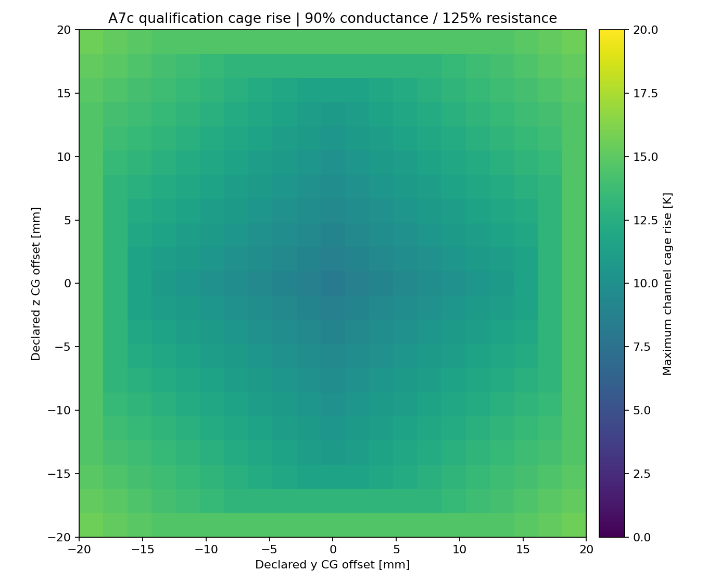
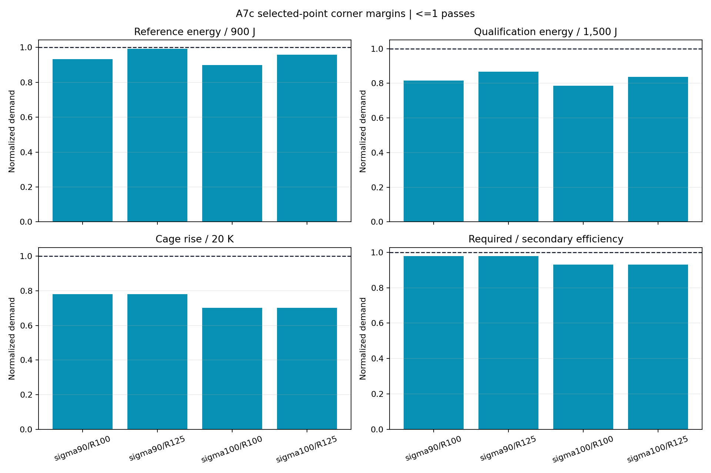
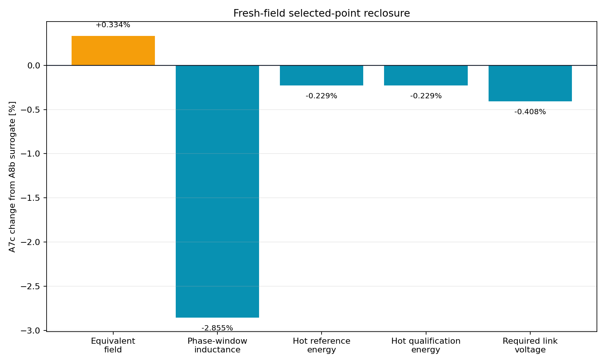

# A7c selected Gen2.7 Fluxrelay cage/circuit reclosure

> **Generated by `tools/make_gen27_cage_circuit.py`. Do not hand-edit.**  
> Evidence class: **POST-FIELD HOMOGENIZED CAGE + LUMPED SECTIONAL CIRCUIT/CG SHOT MODEL**.  
> I do not present this as switching, transient force, structural or hardware evidence.

## What I found

**I found 4/4 robustness corners passing all 29 frozen hard
bands.** I made no post-run change to the selected point, model, corners or thresholds.

| Quantity | Worst A7c result | Frozen band | Outcome |
|---|---:|---:|---:|
| Reference source energy | 893.412 J | <=900 J | PASS |
| Reference energy margin | 6.588 J (0.732%) | >0 J | PASS |
| Qualification source energy | 1302.169 J | <=1,500 J | PASS |
| Source-to-payload efficiency | 34.559% | >=30% | PASS |
| Secondary-only efficiency | 51.074% | >=50% | PASS |
| Cage copper rise | 15.593 K | <=20 K | PASS |
| Cage current density | 151.777 A/mm2 | <=180 A/mm2 | PASS |
| Cage slip | 5.693 m/s | <=8 m/s | PASS |
| Required DC link | 13.049 V | <=48 V and >=10% margin | PASS |
| Peak DC power | 11.676 kW | <=15 kW | PASS |
| Primary copper rise | 0.619 K | <=3 K | PASS |
| Terminal frequency | 129.348 Hz | <=350 Hz | PASS |
| Unbalanced normal force | 19.791 N | <=100 N | PASS |

## What changed from my A8b surrogate

My fresh equivalent-sheet field is 0.533890 T,
up 0.334% from A8b. My solved active-window inductance is
4.81156 uH, down
2.855%. At the controlling 90%-conductance / 125%-resistance corner, my
reclosure changes reference energy by -2.054 J to
893.412 J.

The point passes, but I have only 6.588 J of model margin on the controlling
reference shot. I will not round that into a comfortable result or treat the arbitrary 125%
resistance corner as supplier-backed winding evidence.

## What I decided next

I promoted the exact selected point to provisional A5e Gen3 CAD and an A9 transient sectional-drive
gate. Gen3 must account for structure, containment, insulation, cooling, wiring and real winding
length without hiding them inside my 92 g active-material margin. A9 must resolve cell handoff,
current rise, force ripple, failed-cell behavior and exit timing.

I retain the complete 3,528-point table in
`analysis/results/gen27_cage_circuit_points.csv.gz`.

See my immutable [A7c run sheet](../validation/A7c_gen27_cage_circuit.md).
