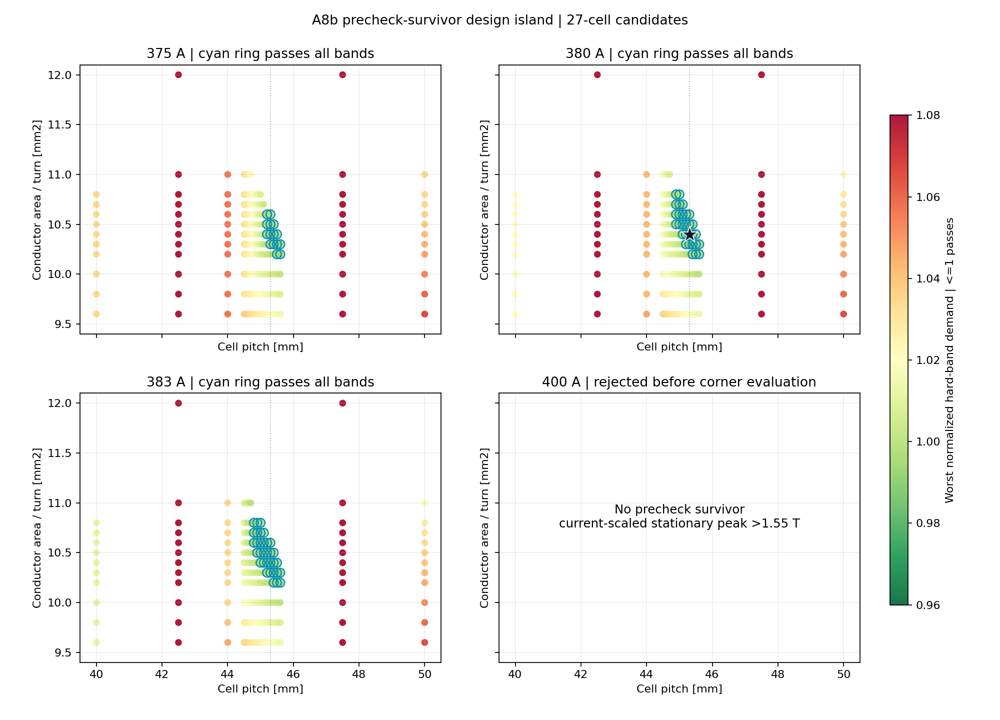
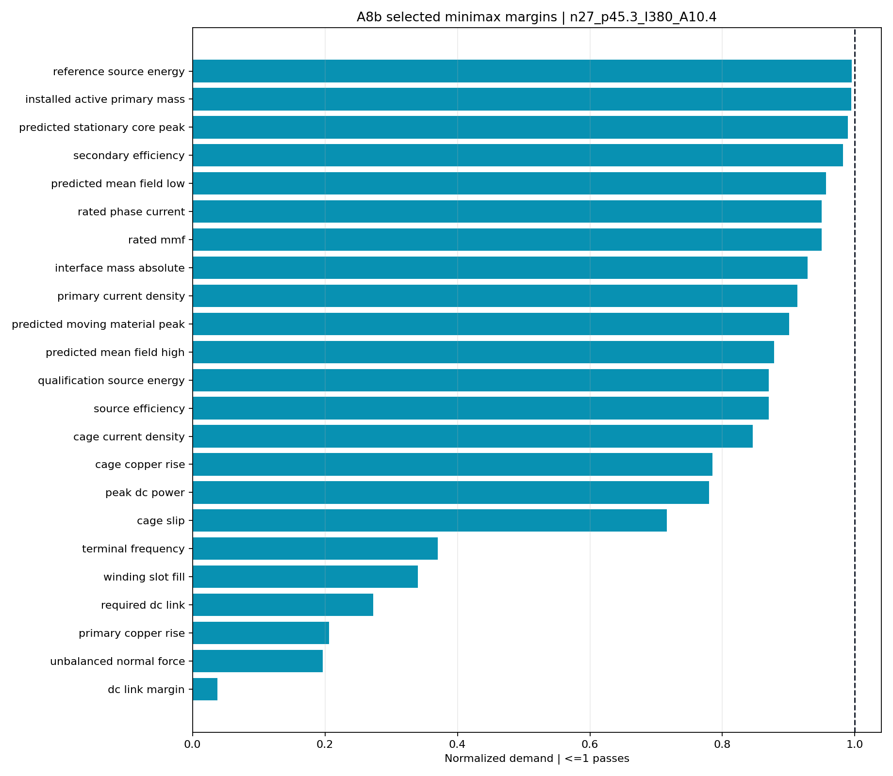
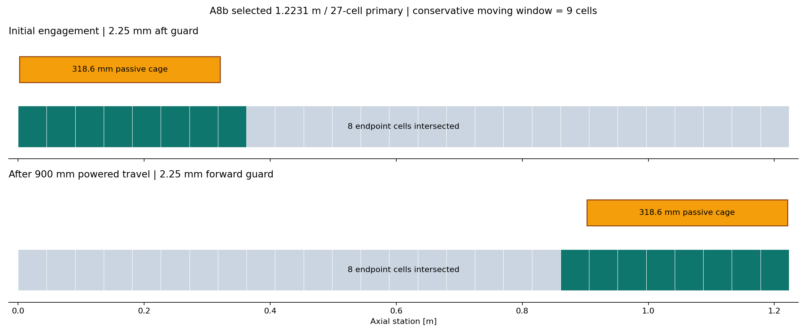

# A8b Gen2.7 Fluxrelay co-design

> **Generated by `tools/make_gen27_codesign.py`. Do not hand-edit.**  
> Evidence class: **COUPLED AXIAL / SECTIONAL-WINDING / CAGE-CIRCUIT MODEL**.  
> I use current-scaled A6g field values as surrogates here; I do not present this as a new
> nonlinear field solve, transient electromagnetic FEA or measurement.

## What I found

**I found 77 of 2,856 candidates passing
every declared hard band.** I fully evaluated 486 candidates
that passed the geometric, mass, winding and field-surrogate precheck, including all four robustness
corners over both 21 by 21 CG grids. By my deterministic minimax rule, I selected
`n27_p45.3_I380_A10.4`.

| Selected quantity | A8b value | Frozen band | Outcome |
|---|---:|---:|---|
| Cells per face channel | 27 | complete 3-phase lattice | PASS |
| Cell pitch | 45.3 mm | searched | selected |
| Installed stator length | 1.2231 m | full 0.90 m travel + guards | PASS |
| Passive cage length | 318.6 mm | 200–336 mm | PASS |
| End engagement guard | 2.25 mm | >=2.25 mm | PASS |
| Rated phase current | 380 A | <=400 A | PASS |
| Conductor area per turn | 10.4 mm2 | current density <=40 A/mm2 | PASS |
| Installed active primary | 15.908 kg | <=16.0 kg | PASS |
| Spacecraft interface increment | 0.371 kg | <=0.40 kg | PASS |
| Active-window phase resistance | 0.7873 x A7b | <=0.8202 diagnostic | PASS |
| Worst reference source energy | 895.47 J | <=900 J | PASS |
| Worst qualification source energy | 1,305.16 J | <=1,500 J | PASS |
| Minimum secondary efficiency | 50.91% | >=50% | PASS |
| Worst cage copper rise | 15.70 K | <=20 K | PASS |
| Required DC link | 13.10 V | <=48 V and >=10% margin | PASS |
| Predicted stationary-core peak | 1.5340 T | <=1.55 T | PASS surrogate |

## The machine I selected

I gave each of the four face channels 27 stationary cells in a repeating three-phase lattice.
With a 45.3 mm pitch, I obtain a 1.2231 m installed primary. I start the 318.6 mm five-lane passive
cage 2.25 mm inside the payload end and finish the 900 mm powered travel with another 2.25 mm of
engagement. The cage can intersect at most 9 cells at once,
so I energise no more than
3 cells per phase in each channel.

I use that distinction to close A8a without pretending the unused primary disappears. I count all
27 cells against the installed-mass band, while only the active window contributes pulse
copper/core loss and temperature. At my selected 10.4 mm2 conductor area, active-window resistance
falls to
0.7873 of A7b and the worst hot reference corner falls to
895.47 J.

## Why I selected this point

I did not select on one attractive number. I minimised the weakest continuous hard band, then
installed primary mass, then hot reference energy. My selected point's five tightest demands are:

| Band | Normalized demand | Remaining model margin |
|---|---:|---:|
| Reference Source Energy | 0.9950 | 0.50% |
| Installed Active Primary Mass | 0.9943 | 0.57% |
| Predicted Stationary Core Peak | 0.9896 | 1.04% |
| Secondary Efficiency | 0.9822 | 1.78% |
| Predicted Mean Field Low | 0.9568 | 4.32% |

I found a narrow, coupled solution rather than an oversized optimum. More pitch or copper breaks
my 16 kg primary limit; less copper or cage length raises resistance and source energy; more
current consumes the already narrow nonlinear-field surrogate margin. My feasible island contains
only 27-cell candidates, 44.8–45.6 mm pitch, 375–383 A and 10.2–10.8 mm2 conductors.

## What I still need to close

- I must solve the selected 380 A point in A6h on fresh coarse/fine/alternate nonlinear meshes. The
  1.534 T stationary-core value is only a current-scaled A6g estimate.
- I must rerun the selected point in A7c from A6h field and inductance outputs rather than A8b
  surrogates.
- I have not yet closed cell handoff, end effects, force ripple, inverter partitioning or fault
  containment; they remain outside the model.
- I have not included structure, winding end turns, cooling, fasteners or power electronics in the
  15.91 kg active-primary accounting.
- I may encode this point in Gen3 CAD for fit inspection, but I will not use CAD to turn these
  model margins into hardware evidence.

I retain my complete 2,856-candidate artifact at
`analysis/results/gen27_codesign_candidates.json.gz`, SHA-256
`2ad36b89d32acd9c6fe76b1644d1f53de2f9e4de23c263eed554cb2c0808b378`. See the immutable
[A8b run sheet](../validation/A8b_gen27_codesign.md).
