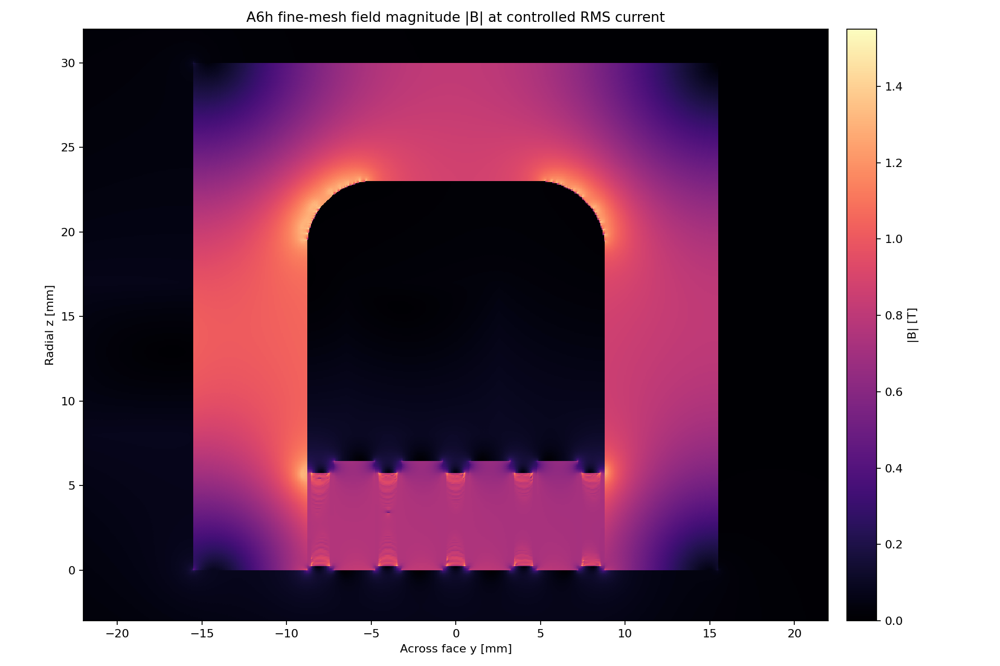
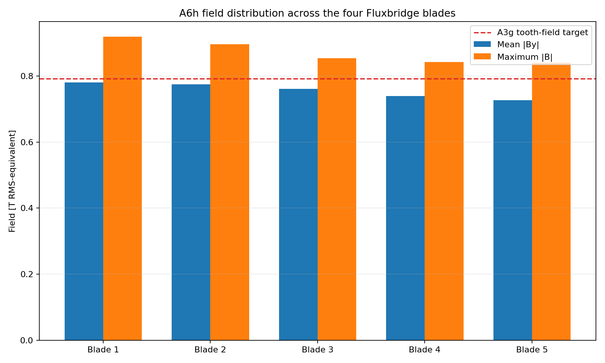
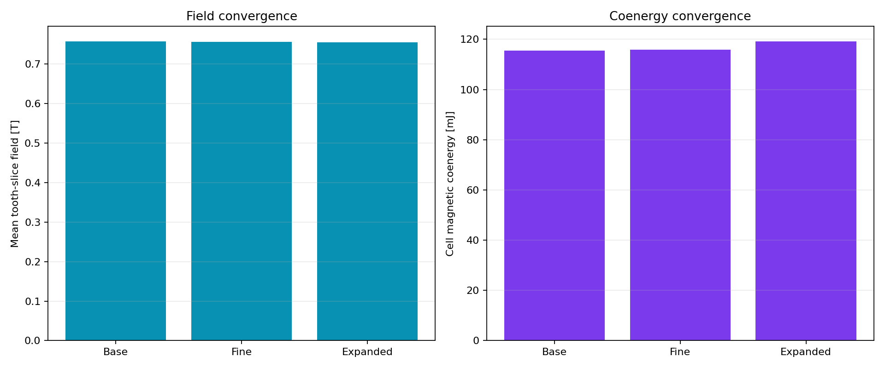

# A6h selected Gen2.7 Fluxrelay field gate

> **Generated by `tools/make_gen27_field.py`. Do not hand-edit.**  
> Evidence class: **THREE-MESH 2D NONLINEAR RMS-EQUIVALENT MAGNETOSTATIC FEA**.  
> I use the worst physical value from all three meshes. I do not present this as transient force,
> axial-end, switching or hardware evidence.

## What I found

**I found 13/13 frozen bands passing at the exact A8b
point.** I made no post-run change to the geometry, excitation, mesh, material assumptions or
acceptance bands.

| Quantity | A6h controlled result | Frozen band | Outcome |
|---|---:|---:|---:|
| Base-to-fine mean-field change | 0.221% | <=2.000% | PASS |
| Base-to-fine coenergy change | 0.279% | <=4.000% | PASS |
| Expanded-boundary mean-field change | 0.345% | <=2.000% | PASS |
| Worst-mesh mean field | 0.7550–0.7576 T | 0.7200–0.8600 T | PASS |
| Worst slot imbalance / height CV | 4.302% / 4.676% | <=5% / <=15% | PASS |
| Worst moving-material peak | 1.3434 T | <=1.4500 T | PASS |
| Worst stationary-core peak | 1.5284 T | <=1.5500 T | PASS |
| Fine three-cell phase-window inductance | 4.81156 uH | 0.85–1.15 x A8b | PASS |
| Inductance ratio to A8b | 0.97145 | 0.85–1.15 | PASS |
| Worst source / nonlinear closure | 2.992e-16 / 9.560e-05 | <=1e-10 / <=1e-4 | PASS |

## What changed from my A8b surrogate

I replaced A8b's current-scaled stationary peak of
1.53395 T with a fresh worst-mesh value of
1.52843 T (-5.52 mT). I replaced its predicted moving peak of
1.30598 T with 1.34336 T
(+37.38 mT). The moving peak rose, but it still retains
7.35% model margin; the stationary peak retains
21.57 mT.

I also replaced A8b's 4.95297 uH
three-cell phase-window surrogate with 4.81156
uH from the fine nonlinear mesh. I will carry the solved value into A7c without refitting the
selected geometry or its energy bands.

## What I decided next

I promoted the exact A8b point to A7c selected-point cage/circuit reclosure and provisional Gen3
CAD. I have not validated force, axial end fields, cell handoff, inverter partitioning, structure,
thermal hardware or release performance. A7c remains the next physics gate, and packaged Gen3 mass
can still make me reject Fluxrelay.

See my immutable [A6h run sheet](../validation/A6h_gen27_fluxrelay.md).
