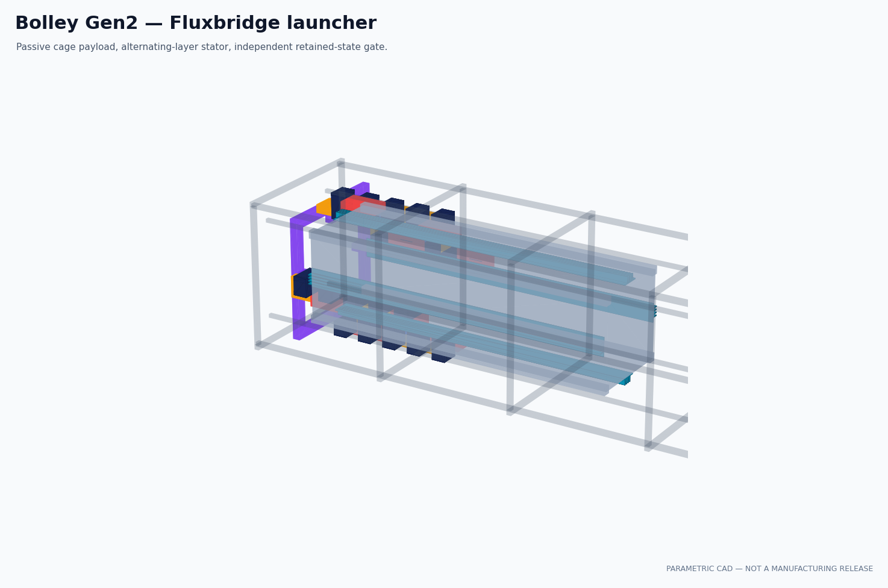

# A5d Gen2 CAD and fit gate

> **Generated by `tools/make_gen2_cad_fit.py`. Do not hand-edit.**  
> Evidence class: **PARAMETRIC CAD + EXACT NOMINAL SOLID INTERSECTION + ARCHIVE MANIFEST**.
> This is not a tolerance study or manufacturing release.

## Result

**13/13 declared bands pass.** Failed bands: none.

| Quantity | Gen2 result |
|---|---:|
| Controlled A3g point | p30_B0.56 |
| Payload envelope | 340.5 × 100.0 × 100.0 mm |
| Fluxbridge projection / fin side clearance | 6.25 / 0.20 mm |
| Core footprint | 20.0 mm |
| Stator length / pitch / cell count | 900 / 30 mm / 30 |
| Two-sided gross winding fill | 60.0% |
| Coil-to-Fluxbridge radial clearance | 0.75 mm |
| Payload/stator intersection, four faces | 0.000000 mm³ |
| Coil/core intersection, one face | 0.000000 mm³ |
| Adjacent-coil overlap, one face | 0.000000 mm³ |
| Muzzle opening / frame envelope | 150 / 160 mm |
| CAD / analytical copper volume | 855360.0 / 855360.0 mm³ |
| Copper-volume error | 0.00000000% |
| STEP / STL / indexed renders | 7 / 7 / 9 |

## What A5d closes

Gen2 has a physical winding route. Adjacent 39 × 23 × 9 mm pack envelopes overlap axially in the
shared winding slot, but alternate between two radial layers. Their exact solid intersection is
zero; their exact intersection with the core is zero; and the lower layer clears the Fluxbridge
tip by 0.75 mm. The total CAD pack volume reproduces A3g's analytical copper volume to numerical
round-off.

The full-length interface remains the homogenized A3g representation. The 60 mm coupon separately
resolves 30 copper rungs, 30 magnetic ligaments, continuous root/tip buses and both winding layers.

## Download and regenerate

- [Gen2 STEP masters](../cad/exports/gen2/Bolley_Gen2_STEP.zip)
- [Gen2 STL previews](../cad/exports/gen2/Bolley_Gen2_STL.zip)

The archives are deterministic and verified member-by-member. Native source remains
`cad/build_gen2.py`; hashes, volumes, solid counts and bounds live in `cad/BUILD_GEN2.json`.

## Disposition

**PROMOTE GEN2 GEOMETRY TO FIELD STRUCTURE AND TOLERANCE ANALYSIS.**

A5d does not close the 0.20 mm tolerance stack, individual turns/insulation, end leads, cooling,
lamination manufacture, structure, provider acceptance or the homogenized-cage field assumption.

See the immutable [A5d run sheet](../validation/A5d_gen2_cad.md).
