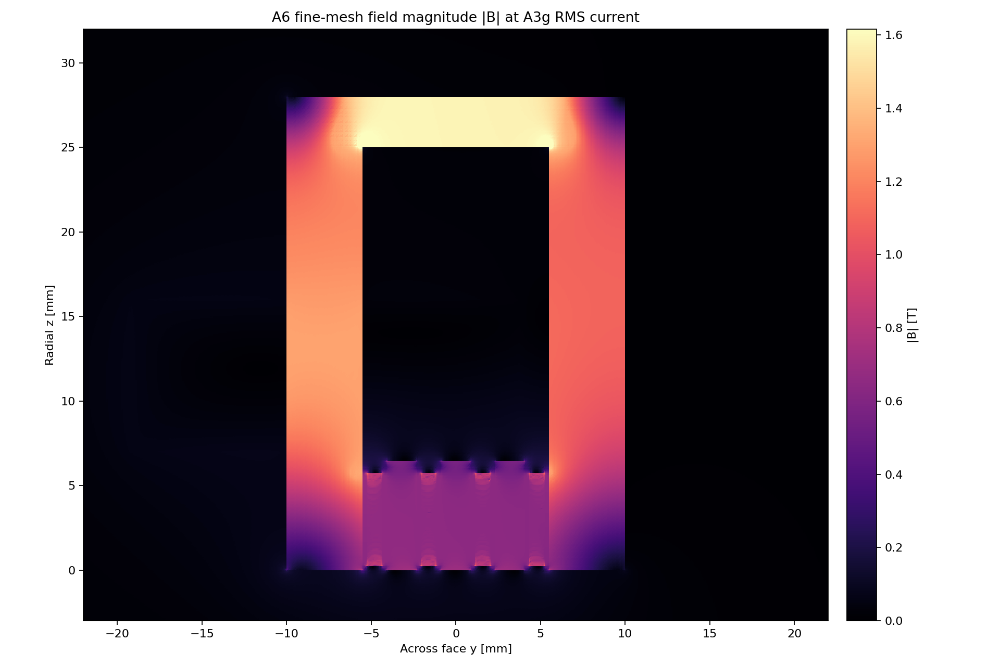
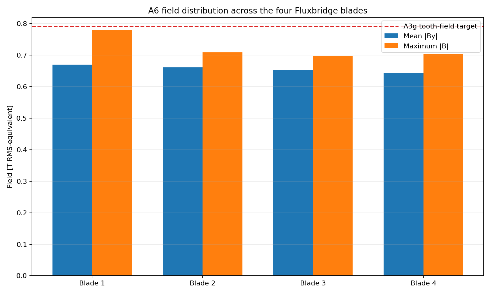
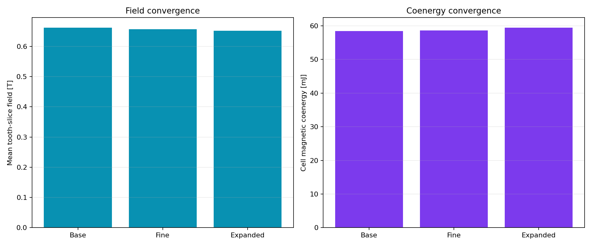

# A6 Gen2 nonlinear transverse-field gate

> **Generated by `tools/make_gen2_field.py`. Do not hand-edit.**  
> Evidence class: **INDEPENDENTLY MESHED 2D NONLINEAR RMS-EQUIVALENT MAGNETOSTATIC FEA**.
> This is model evidence, not measured field or force.

## Result

**10/13 declared bands pass.** Failed bands:
mean field lower, stationary core field, inductance upper.

| Quantity | Fine-mesh result | Frozen band | Outcome |
|---|---:|---:|---:|
| Base-to-fine mean-field change | 0.786% | <=2.000% | PASS |
| Base-to-fine coenergy change | 0.295% | <=4.000% | PASS |
| Expanded-boundary mean-field change | 1.637% | <=2.000% | PASS |
| Mean tooth-slice field | 0.6568 T | 0.7200–0.8600 T | **FAIL** |
| Four-slot flux imbalance | 2.022% | <=5.000% | PASS |
| Active-height field CV | 2.541% | <=15.000% | PASS |
| Inferred ligament peak | 1.2489 T | <=1.4500 T | PASS |
| Stationary-core peak | 3.2346 T | <=1.5500 T | **FAIL** |
| Stationary-core area-weighted p99 | 1.5950 T | diagnostic | — |
| Per-cell inductance ratio to A3g | 1.3945 | 0.7000–1.3000 | **FAIL** |
| Source-current residual | 0.000e+00 | <=1.000e-10 | PASS |
| Final nonlinear solution change | 5.445e-05 | <=1.000e-4 | PASS |

The fine mesh contains 311,714 nodes and 621,180 first-order
triangles. It converges in 21 nonlinear updates. Every retained
linear solve closes below the declared relative residual.

## What failed—and what did not

The actual tooth-slice field is 17.1% below A3g's 0.7920 T
target. Raising current into the same geometry is not an acceptable rescue: the stationary return
already reaches 3.235 T, and even its area-weighted p99 is
1.595 T. The independently integrated inductance is
39.5% above A3g, so the existing pulse-energy
and voltage point is no longer controlled.

The four-slot idea itself survives this gate. Slot imbalance, active-height uniformity, moving
ligament field, current closure, mesh convergence and outer-boundary sensitivity all pass. The
failure is concentrated in the stationary return geometry and the A3g lumped MMF/inductance
closure—not in nominal fit or in the passive Fluxbridge interface principle.

## Disposition

**DO NOT PROMOTE GEN2 FIELD POINT.**

A3g `p30_B0.56` is rejected as an operating point and must not control a drive, thermal or force
claim. Gen2 CAD remains useful as a fit-controlled starting geometry. Gen2.1 must redistribute
stationary return flux, recover mean blade field without overdriving the core, and rerun circuit
closure before any transient cage-force solve.

See the immutable [A6 run sheet](../validation/A6_gen2_field.md).
