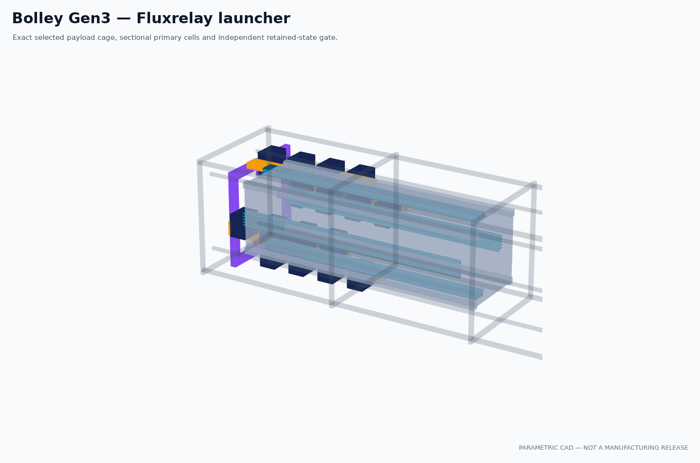
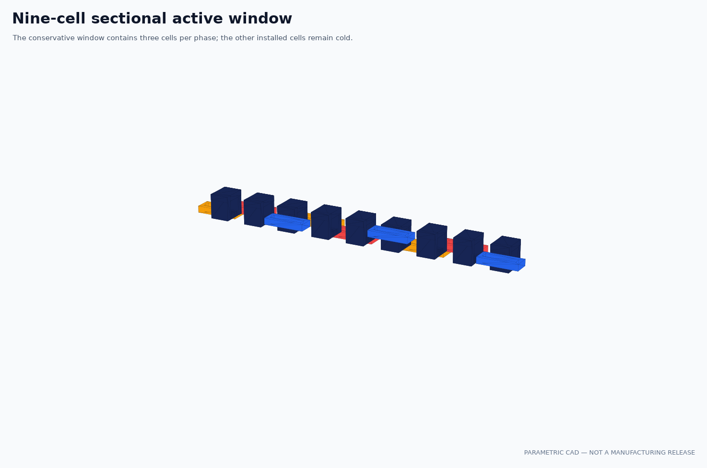

# A5e Gen3 Fluxrelay CAD and fit gate

> **Generated by `tools/make_gen3_cad_fit.py`. Do not hand-edit.**  
> Evidence class: **PARAMETRIC CAD + EXACT NOMINAL SOLID INTERSECTION + ARCHIVE MANIFEST**.
> I do not present this as a tolerance study, structural design or manufacturing release.

## What I found

**17/17 frozen bands pass.** Failed bands: none.

| Quantity | My Gen3 result |
|---|---:|
| Controlled selected point | `n27_p45.3_I380_A10.4` |
| Payload envelope | 340.5 × 100.0 × 100.0 mm |
| Active cage start / length | 2.25 / 318.6 mm |
| Finished lanes per face / width | 5 / 1.18 mm |
| Lane side clearance | 0.20 mm |
| Stator length / pitch / cell count | 1223.1 / 45.3 mm / 27 |
| Conservative active window | 9 cells |
| Two-sided gross winding fill | 20.41% |
| Coil-to-lane radial clearance | 0.75 mm |
| Endpoint engagement guard | 2.25 mm |
| Payload/stator intersection, four faces | 0.000000 mm³ |
| Coil/core intersection, one face | 0.000000 mm³ |
| Adjacent-coil overlap, one face | 0.000000 mm³ |
| Muzzle opening / frame envelope | 150 / 160 mm |
| CAD / A8b installed copper volume | 532846.080 / 532846.080 mm³ |
| Copper-volume relative error | 4.441e-16 |
| Interface / active-primary mass | 0.371364 / 15.908104 kg |
| Active-material margin to 16 kg | 91.896 g |
| STEP / STL / inspected renders | 8 / 8 / 10 |

## What I closed in A5e

I replaced the historical 900 mm Gen2 package with a new, dimension-controlled Gen3 build. The
CAD now carries my exact 318.6 mm five-lane Fluxrelay cage, 27 cells at 45.3 mm pitch, four
independently arranged stator faces and a distinct nine-cell sectional window. The cage preserves
its full 2.25 mm overlap guard after 900 mm of travel.

I routed adjacent winding packs in alternating radial layers. Their exact nominal intersection is
zero, their intersection with the magnetic core is zero, and the nearest pack clears the passive
lane tip by 0.75 mm. My complete winding-envelope volume reproduces A8b's installed copper volume
to numerical round-off.

The full-length lanes remain the homogenized A6h/A7c representation. I also built a separate
100 mm coupon with fifty resolved web/rung periods so I do not disguise the homogenization as
manufacturing detail.

## Download and regenerate

- [My Gen3 STEP masters](../cad/exports/gen3/Bolley_Gen3_STEP.zip)
- [My Gen3 STL previews](../cad/exports/gen3/Bolley_Gen3_STL.zip)

I fix archive timestamps and verify every member by size and SHA-256. The native construction source
is `cad/build_gen3.py`; exact solid counts, volumes, bounds and checks are in
`cad/BUILD_GEN3.json`.

## What I decided next

**PROMOTE GEN3 NOMINAL GEOMETRY TO TOLERANCE STRUCTURE AND A9.**

I have closed nominal geometry, not a build release. I still need individual turns, insulation,
leads, lamination detail, a real cage layup and root capture, tolerances, thermal growth, structure,
containment, cooling, sensors, wiring, gate hardware and a full packaged mass. My remaining 91.896 g
inside the active-material band is not an allowance for those systems. A9 must also close current
rise, cell handoff, force ripple, failed-cell behavior and exit timing.

See my immutable [A5e run sheet](../validation/A5e_gen3_cad.md) and
[manual-detail ledger](../cad/GEN3_MANUAL_DETAILS.md).
