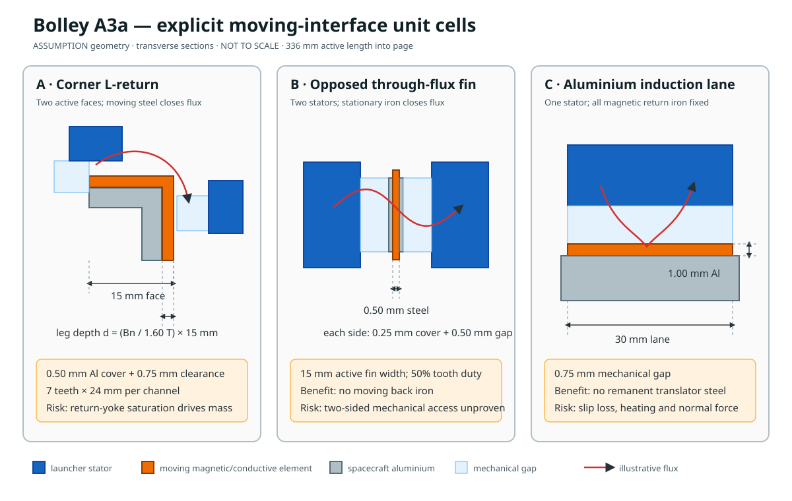

# A3a topology candidates

I used the initial 0.50 mm magnetic-equivalent thickness as an area-times-density mass screen; it
did not define where flux returns. In A3a I replaced that ambiguity with three explicit unit cells
before nonlinear FEA.

## 1. Corner L-return reluctance rail

Two orthogonal launcher poles pull on two faces of a segmented L-shaped steel tooth at each
CubeSat corner. This preserves four-corner force allocation and familiar rail placement, but the
moving L must carry flux around the corner. Its leg depth therefore grows with normal air-gap
flux and can dominate payload-interface mass.

## 2. Opposed through-flux fin/tab

Two launcher stator halves face one another across a thin, toothed steel fin. Flux crosses the
steel thickness; the stationary stators provide the return path. This sharply reduces moving
magnetic mass. Its hard problem is mechanical access: a real dispenser cross-section must place
stator iron on both sides without violating the CubeSat envelope or blocking spacecraft panels.

## 3. Single-sided aluminium induction lane

A wide passive aluminium strip becomes the secondary of a launcher-side linear induction motor.
All windings and back iron stay stationary, and the spacecraft carries neither remanent material
nor a flux-return yoke. The price is slip loss, secondary heating, edge effects and attractive
normal force. A mass-and-area pass only earns a transient electromagnetic/thermal model.

I use the drawing as a topology screen, not as released CAD. I use its dimensions as executable
inputs and deliberately label them as assumptions.
